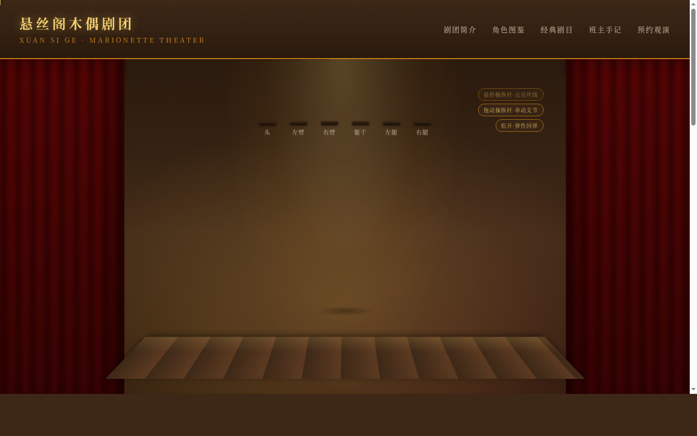

# 提线木偶剧场 · V1 网页设计

**日期**：2026-08-19
**方向**：V1 网页设计
**主题**：提线木偶剧场 — 悬丝阁木偶剧团沉浸式网站

## 简介

整个网站是一座可探索的微型木偶剧院。用户通过悬停和拖拽"操纵杆"控制舞台中央的木偶关节运动——每根线连接一个关节，拉动时全身联动，松手时缓缓复位。同时浏览剧团档案、角色图鉴和演出剧目。

## 截图展示

## 动效亮点

- 木偶入场落体缓动 + 操纵杆依次入场
- 幕布呼吸 + 聚光灯摇曳 + 尘埃粒子漂浮
- 关节弹性回弹（弹簧物理模型）
- 待机浮动呼吸 + 眨眼 + 阴影呼吸
- 丝线张紧高亮 + 舞台视差跟随
- 自定义光标（提线钩针形态 + 点击脉冲）

## 页面结构

| 区域 | 内容 |
|------|------|
| 舞台中心 | 可交互木偶（6 关节：头/双臂/双手/躯干/双腿） |
| 操纵杆区 | 6 根木柄操纵杆，悬停高亮对应丝线，拖拽驱动关节 |
| 角色图鉴 | 武生/旦角/丑角/老生 四角色卡片 |
| 剧目档案 | 夜奔/闹天宫/白蛇传/钟馗嫁妹 |
| 班主手记 | 线控技法/关节调校/舞台机关 |

## 妙搭预览链接

https://dcniaqwtmoca.feishu.cn/page/RTS4maLBzdnvGma7l0pcpXLknRh

## 文件说明

| 文件 | 说明 |
|------|------|
| index.html | 完整源码（纯 vanilla 单文件） |
| 设计规范.md | 设计规范文档 |
| preview.png | 1440×900 桌面端截图 |
| thumbnail.png | 妙搭自动生成缩略图 |

## 技术栈

- 纯 HTML/CSS/JS（vanilla，无 React/Babel/CDN）
- CSS keyframes + JS requestAnimationFrame 驱动关节物理
- 支持 prefers-reduced-motion
- 自定义光标系统
