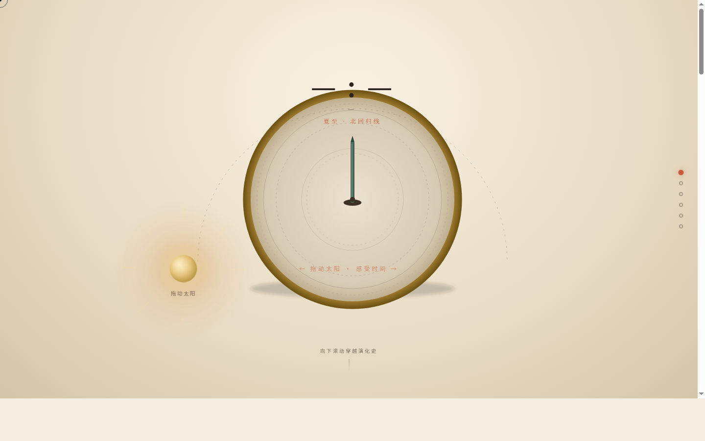

# 日晷博物馆·光影计时器演化展

## 简介
一座以光影本身为核心展品的数字博物馆。固定舞台中央放置一座可交互日晷，用户拖动太阳模拟一天轨迹，日晷指针阴影实时变化，随滚动穿越赤道式/地平式/子午晷/便携式日晷演化史。

## 主题
日晷博物馆·光影计时器演化展——光影本身是展品。

## 截图展示

## 妙搭预览链接
https://dcniaqwtmoca.feishu.cn/page/M4LgmlllSdGuKPaxK25c2Bc0nBc

## 文件说明
- `index.html`——纯 vanilla 单文件源码（HTML+CSS+JS，约48KB）
- `preview.png`——chromium 无头截图（1440×900）
- `设计规范.md`——设计规范文档
- `thumbnail.png`——妙搭平台自动生成缩略图

## 技术栈
纯 vanilla 单文件，无 React / Babel / CDN 依赖。支持 prefers-reduced-motion、页面可见性暂停、卸载清理。

## 设计要点
- 配色：暖陶土铜器色系（赭石/铜青/墨褐/米白），零蓝紫渐变
- 空间模型：固定舞台 + 光影滚动叙事
- 核心交互：拖动太阳→晷针阴影实时跟随（方向/长度/宽度/透明度物理计算）
- 动效：17个组件级特效，全部服务于光影物理
- 自定义光标：三态（默认/拖拽/文本），开页居中
- 内容：真实日晷知识（赤道式/地平式/子午晷/便携式，十二时辰，百刻制，季节赤纬）
