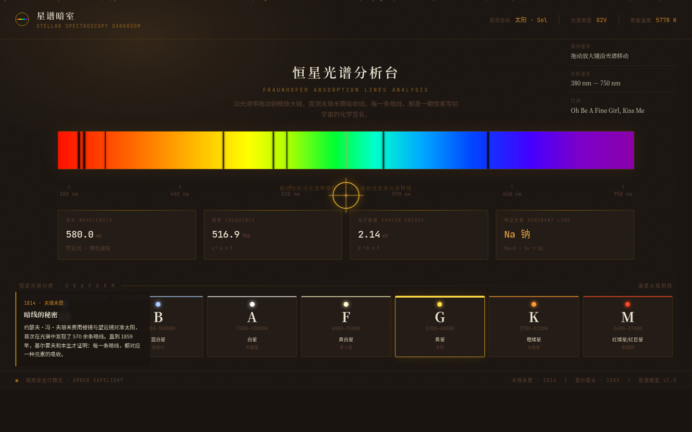

# 星谱暗室 · Stellar Spectroscopy Darkroom

> 天文台暗房中的恒星光谱分析台——琥珀色安全灯下，一条水平光谱色散带横贯屏幕，暗色夫琅禾费吸收线切割光谱，点击即识别化学元素及其电子跃迁。

## 主题
天体物理光谱学。1814年夫琅禾费用棱镜发现太阳光谱中的暗线，1859年基尔霍夫证明每条暗线对应一种元素的吸收——人类首次知道恒星由什么构成。本网站将这一发现过程转化为可交互的暗房仪器体验。

## 简介
整站是一座天文台暗房。琥珀色安全灯映着一切，面前是一条恒星光谱色散带——从红端到紫端的连续彩带，上面散布着暗色吸收线。拖动铜框放大镜光标沿光谱移动，不同波长处的恒星数据实时显现（波长、频率、光子能量、特征元素）。点击一条吸收暗线，右侧滑出元素详情面板：氢原子能级图上电子跃迁轨道以动画绘制，推断文字告诉你这条线的强度意味着什么类型的恒星。

## 核心交互
- **沿光谱拖拽**：鼠标在光谱带上移动 → 扫描指示器跟随 → 实时更新波长/频率/能量/元素
- **点击吸收线**：8条真实夫琅禾费线（H-α 656.3nm 氢 / Na-D 589.0nm 钠 / Mg-b 518.4nm 镁 / Fe 527.0nm 铁 / H-β 486.1nm 氢 / H-δ 410.2nm 氢 / Ca-H 396.8nm 钙 / Ca-K 393.4nm 钙）可点击 → 元素识别+电子跃迁图+恒星类型推断
- **恒星分类切换**：OBAFGKM 七型可点击 → 更换观测目标/光谱类型/表面温度

## 妙搭预览
https://dcniaqwtmoca.feishu.cn/page/HxoImvXRBds1zNa84XUcKT9TnBc

## 文件说明
| 文件 | 说明 |
|------|------|
| index.html | 完整源码（纯 vanilla 单文件，CSS+JS 内联） |
| preview.png | 1440px 桌面截图 |
| 设计规范.md | 色值/字体/动效系统/交互说明 |
| design-brief.md | Design Contract（Art Director 阶段产出） |
| README.md | 本文件 |

## 技术栈
- 纯 vanilla 单文件 HTML（无 React/Babel/JS 框架 CDN 依赖）
- CSS linear-gradient 实现可见光谱带（映射真实波长色域）
- SVG 实现氢原子能级图/电子跃迁轨道
- 字体：Noto Serif SC / Noto Sans SC / JetBrains Mono（妙搭平台托管，降级为系统字体）
- RAF 随 visibilitychange 暂停、beforeunload 取消
- prefers-reduced-motion 全降级
- 响应式：1440 / 1024 / 768 / 390

## 自定义光标
铜框放大镜（圆环+十字准星+中心点），开页居中显示，56px→80px 在光谱区缩放，层级最高（z-index:9999）。移动端（≤480px）禁用自定义光标改系统光标。

## 动效（18个组件级特效）
安全灯呼吸 / 暗房微粒尘埃 / 底片显影渐入 / 光谱微脉动 / 吸收线悬停 / 吸收线标签 / 扫描指示器 / 放大镜缩放 / 光标平滑跟随 / 原子核脉动 / 电子跃迁绘制 / 光子箭头 / 详情面板滑入 / 恒星分类悬停 / 底栏圆点脉动 / 操作提示淡入 / 历史注释滑入 / 提示面板滑入

## 配色
暗房琥珀(#C8842A) + 底片奶白(#E8E2D0) + 暖调近黑(#1A1410) + 铜色(#B8860B)。光谱色仅作内容（非 UI 装饰渐变）。禁蓝紫渐变、禁纸本水墨木色、禁冷色深空黑主导。

## 等待协调者检查后提交 GitHub
本作品已完成 Art Director → Designer → Browser QA → Critic → Quality Gate 全流程。禁止执行 git add/commit/push，GitHub 提交由协调者（心跳检查）在质检通过后统一完成。
