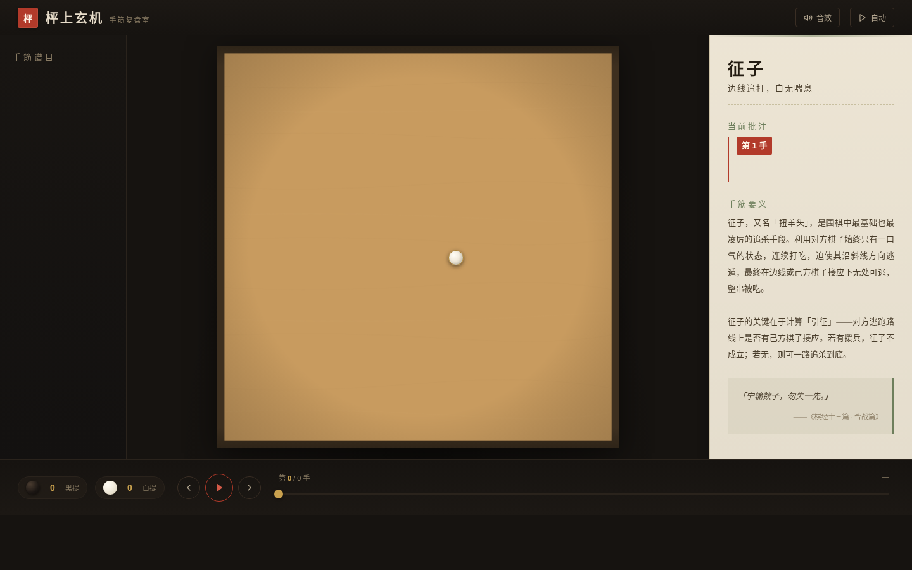

# 枰上玄机 · 围棋手筋复盘室

> 深夜棋院里的打谱室。一块 19 路楸木棋枰占据舞台中央，逐手复盘六个经典围棋手筋——黑白云子落盘、提子入罐，关键妙手落盘瞬间钤下一枚朱砂小印。

## 主题

围棋手筋（Tesuji）文化。以"逐手打谱"为核心交互，用户像坐在棋院看前辈打谱一样，在"全局始终在视野内"的前提下理解每个手筋的原理。六个手筋涵盖：征子、双打、接不归、倒扑、门吃、一线收气——所有手顺由真实围棋规则引擎（Python）逐手推演验证，非示意图。

## 在线预览

[枰上玄机 · 围棋手筋复盘室](https://dcniaqwtmoca.feishu.cn/page/FJ0pmJVPTdvhq0azHAJc41DQncg)

## 交互说明

- **逐手打谱**：前一手 / 后一手按钮 + 键盘 ← →
- **刻度尺跳手**：底部每一手一格，点击直接跳转；关键手为朱砂色
- **自动播放**：约 1.1 秒/手呼吸节奏，关键手处停顿钤印
- **谱目切换**：顶部索引或左侧列表切换六个手筋
- **键盘快捷键**：← → 翻手，空格自动播放，数字键 1–6 切谱

## 视觉风格

深夜棋院氛围：暖褐黑底色（#161310）、楸木棋枰（#C89B5F）、云子白（#F4EEE1）与玄子黑（#1B1613）、朱砂印章（#B23A2A）、宣纸批注卷（#F1E9D8）、竹青描边（#6E7F5C）、黄铜金数字（#A8843C）。禁用蓝紫渐变与毛玻璃。

## 文件说明

| 文件 | 说明 |
|------|------|
| `index.html` | 纯 vanilla 单文件，内联 CSS + JS，69KB |
| `demos.json` | 六个手筋的验证数据（规则引擎逐手推演） |
| `preview.png` | 1440×900 桌面端截图 |
| `设计规范.md` | 从源码提取的色值、字体、动效系统 |

## 技术栈

- 纯 vanilla HTML/CSS/JS，零外部依赖（无 React/Babel/CDN）
- CSS + SVG 绘制棋盘/棋子/朱砂印
- WebAudio API 合成落子声与提子声（无音频文件）
- CSS Grid 响应式布局（桌面三栏 / 移动纵向）
- 16 项组件级动效（@keyframes + WebAudio + JS 驱动）
- 自定义光标（米白云子 + 黄铜描边，屏幕正中央起始，z-index 9999）
- 健壮性：visibilitychange 暂停 / beforeunload 清理 / prefers-reduced-motion 降级

## 设计日期

2026-08-19
