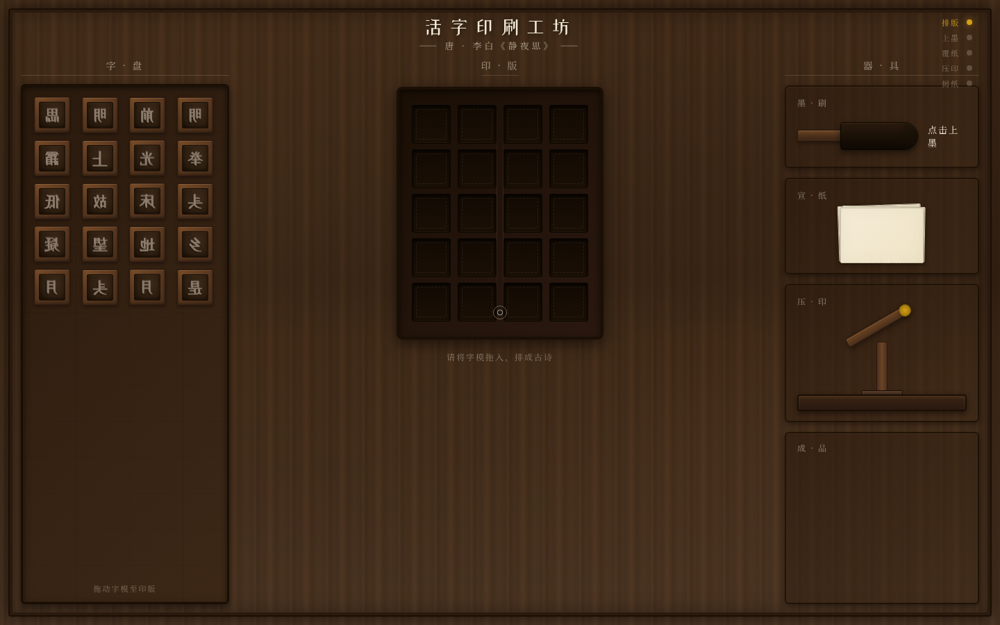

# 活字印刷工坊 V1 · 网页 Mock

主题：俯视一张木质活字印刷工作台，亲手完成李白《静夜思》的活字排版与印刷。

## 简介
整页是一张俯视的深棕木质活字印刷工作台，分字盘 / 印版 / 器具三区。用户从左侧字盘拖拽反刻活字模到中部印版排成竖排古诗，再依次点击墨刷上墨、覆宣纸、下压压印扳手、揭纸——墨字从版面转印到宣纸，成品清晰可见。可重置重新再来。

## 截图

## 妙搭预览链接
https://dcniaqwtmoca.feishu.cn/page/DScDmg87TdnxFAaAk8HcIZZtnSc

## 文件说明
- `index.html` — 纯 vanilla 单文件源码
- `设计规范.md` — 色彩/字体/空间/动效系统
- `preview.png` — 桌面 1440×900 截图
- `thumbnail.png` — 妙搭缩略图

## 技术栈
纯 vanilla 单文件 HTML（HTML+CSS+JS 内联），无外部依赖。自定义光标 RAF 阻尼跟随，支持 prefers-reduced-motion。响应式 1440/1024/768/390。

## 设计母题
俯视活字印刷工作台——空间模型为工作台三区，区别于竖向滚动堆叠。设计语言来自传统木作印刷台与铅活字，纸（米白）+墨（黑）+木（棕）+铜（金）四色体系。
