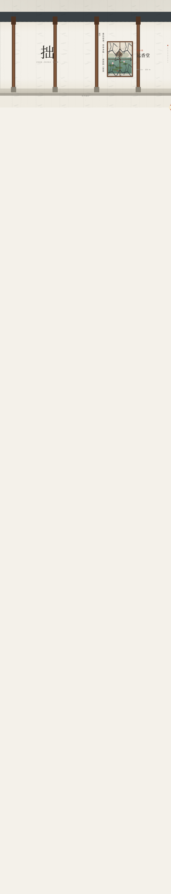

# 游廊纪行 · 苏州园林框景漫步

**类别**：Web Mock　**日期**：2026-08-19　**形态**：网页（单文件 HTML）

## 简介
一段苏州园林游廊漫步。竖向滚动即沿游廊前行，粉墙在侧，漏窗与门洞依次框出园景——设计母题是「移步换景」。穿过月洞门时视野收成一枚圆，再豁然开朗。四座名园（拙政园 / 留园 / 网师园 / 沧浪亭）的真实景名与营造知识嵌在连续框景序列中。

## 截图

## 妙搭预览
https://dcniaqwtmoca.feishu.cn/page/RuDgm7v3UdEW2Sal3BTc2cmwnYc

## 文件说明
| 文件 | 说明 |
|---|---|
| index.html | 单文件实现（HTML + 内联 SVG/CSS/JS，78.8KB） |
| 设计规范.md | 设计母题、空间模型、色彩体系、动效系统、健壮性红线 |
| preview.png | Browser QA 截图（1440×900 首屏） |
| thumbnail.png | 平台缩略图 |

## 技术栈
- 纯 HTML + 内联 SVG（漏窗纹样镂空蒙版）+ CSS + 原生 JS
- 无外部依赖 / 无 CDN
- requestAnimationFrame 渲染 + visibilitychange 暂停
- prefers-reduced-motion 降级
- 响应式：1440 / 1024 / 768 / 390 四档

## 核心交互
- 滚动 = 行走（廊柱与窗景随滚动位移）
- 点击漏窗 = 探身（窗景放大全屏细览）
- 月洞门 iris 圆孔转场
- 白纸灯笼自定义光标（开页居中、可点击处变亮）

## 设计要点
- 游廊式空间模型全库零重复（避开地图导航、时间游标、垂直剖面、横向长卷等近期模式）
- 6 种真实漏窗纹样（冰裂/海棠/万字/如意/竹节/六角龟背）
- ≥16 个组件级特效，全部符合园林物理语义
- 禁蓝紫渐变；粉墙白 + 黛瓦青灰 + 苔绿 + 廊柱栗棕 + 朱砂 + 池水青
