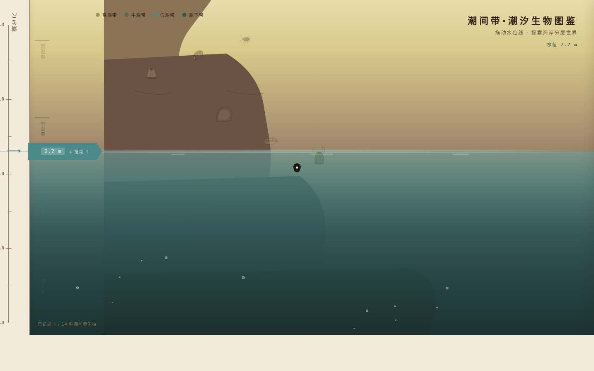

# 潮间带·潮汐生物图鉴

## 主题

海岸潮间带生物图鉴——以垂直潮位标尺为核心导航，拖动水位模拟潮汐涨退，逐层暴露不同潮位带的生物。

## 简介

一个真实可交互的博物图谱网站。左侧是垂直潮位标尺（高潮带→中潮带→低潮带→亚潮带），用户拖动水位手柄上下移动模拟潮汐变化。水位下降时，原本浸没在水下的生物逐层显现——藤壶、牡蛎、石鳖、海葵、海星、海参、藻类等，每种生物有自己的入场动画和微动效。点击生物卡片弹出详情面板，展示拉丁学名、形态特征和潮位带归属。

## 截图

## 妙搭预览

https://dcniaqwtmoca.feishu.cn/page/C4wpmT52Ydjxy5aUYtpc3t2inDd

## 文件说明

| 文件 | 说明 |
|------|------|
| index.html | 完整源码（HTML+CSS+JS 单文件） |
| 设计规范.md | 色彩/字体/动效/布局规范 |
| preview.png | 1440×900 桌面截图 |

## 技术栈

纯 vanilla 单文件（HTML+CSS+JS），无 React/Babel/CDN 依赖。17 组 keyframe 动画 + RAF 水位拖拽物理。自定义白色圆环光标。支持 prefers-reduced-motion。

## 配色

深苔绿+暗褐+沙金+米白的自然博物色调，不使用蓝紫渐变。
