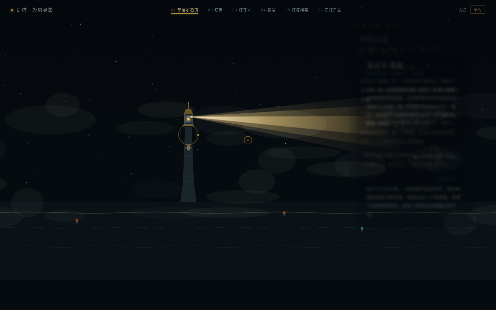

# 灯塔 · 光束显影 (Lighthouse Beam Reveal)

> Art 每日设计 Mock · V1 网页设计 · 2026-08-19

## 主题
灯塔。整站是一片漆黑夜海，画面中心偏左矗立一座灯塔，页面唯一光源是塔顶的旋转光束。用户拖动光束绕塔旋转，光束扫到哪个方位，哪章内容就从黑暗中显影。**光束即导航，光即阅读行为本身。**

## 简介
这不是一张夜景图，也不是科普 Landing Page。它把「灯塔光束扫过海面、照亮知识」这件事变成网页的唯一交互语言：圆周均分 6 个扇区，分别承载菲涅尔透镜、灯质、灯守人、雾号、灯塔档案、守灯日志六章真实内容；光束离开，内容隐回黑暗。塔顶的灯质节奏可切换演示，雾号按钮用 WebAudio 合成低沉雾笛声——你能听见光失效时声音如何接班。

拖动光束时，浪脊会在光带中闪出鳞光，透镜棱镜高光同时掠过，那是这个网站的签名时刻。

## 截图

## 妙搭预览
在线可交互预览（建议桌面端打开，可拖动光束）：

https://dcniaqwtmoca.feishu.cn/page/G0gImhVjbdt4KGaT1MbcS9LQn4f

## 文件说明
- `index.html` — 纯 vanilla 单文件实现（48.5 KB，零外部依赖）
- `preview.png` — 1440×900 headless 截图
- `设计规范.md` — 实测色值、字体栈、动效系统、内容大纲

## 技术栈
- 纯 HTML / CSS / JavaScript（vanilla，无 React / Babel / CDN）
- 字体：系统字体栈（Songti / PingFang / monospace），零外部字体
- 图形：全部 SVG / CSS 绘制，无外部图片
- 音频：WebAudio API 合成雾笛（首次手势启用，失败静默降级）
- 工程：单 RAF 主循环、visibilitychange 暂停恢复、prefers-reduced-motion 降级、响应式

## 内容来源
灯塔知识为公开常识：菲涅尔透镜分级、灯质闪光节奏、灯守人职责、雾号种类，以及花鸟山灯塔（1870）、老铁山灯塔（1893）、小青岛灯塔（1900）、木兰灯塔（1995）四座真实灯塔的建塔年代与位置。守灯日志为基于真实灯守人职责的文学化演绎，非虚构人物传记。

## 自查结论
- [x] 无白屏，Console 零 error（1440/1024/768/390 四尺寸均非空白）
- [x] 拖动光束可依次显影 6 章真实内容，扇区切换逻辑真实（6×60°，±30° 激活）
- [x] 灯质演示 / 雾号按钮真实工作
- [x] 自定义光标开页居中、高对比、层级最高
- [x] 无蓝紫渐变、无卡片网格、无 Landing Page 套路
- [x] 删除动画后结构仍成立
- [x] 配色与近期作品（长卷 / 地图 / 谱系树 / 舞台拆解等）不雷同
