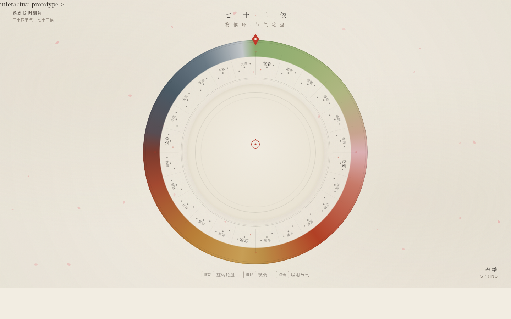

# 七十二候 · 物候环

**类别**：Web Mock　**日期**：2026-08-19

## 简介

整站是一架可拖拽旋转的物候轮盘。二十四节气沿圆环排列，每个节气含三候，共七十二候，全部取自《逸周书·时训解》。拖动轮盘转动一年，圆环色带随四季连续渐变（春绿→夏朱→秋金→冬墨青），圆心联动呈现当前节气的三候物候辞与释义，顶部朱砂指针固定指示。

母题：「天体运行般的节气轮回」——轮盘本身即内容，季节的循环本质被空间化为一个可拨动的圆。

## 在线预览

> [七十二候 · 物候环](https://dcniaqwtmoca.feishu.cn/page/DBU2mlfVRd3iX7aDrhHcVXtdnmO)

## 截图



## 设计要点

- **空间模型**：径向环形（radial wheel）——与近期横向长卷 / 全屏地图 / 垂直剖面 / 工程图纸等线性模型正交
- **核心交互**：拖动轮盘旋转（转动量≈视觉变化量），释放阻尼惯性衰减；点击节气段吸附详情
- **签名时刻**：快速旋过一整圈，色带如四季流转，松手阻尼停在某一节气——「拨动一年」的仪式感
- **自定义光标**：开页居中，朱砂指针形态，高对比，最高层级
- **动效系统**：13 项组件级特效（拖拽旋转 / 阻尼惯性 / 节气段外推 / 墨迹晕染 / 朱砂呼吸 / 四季氛围粒子 / 色带插值 / 吸附过渡 / 印章盖印 / 纸纹微动 / 光标尾迹 / 出处逐字浮现 / 物候辞切换）

## 文件说明

```
├── index.html      # 单文件应用（纯 vanilla，无外部依赖）
├── preview.png     # 桌面 1440×900 截图
└── 设计规范.md     # 色值 / 字体 / 动效系统规范
```

## 技术栈

- 纯 HTML + CSS + 原生 JavaScript（vanilla），无 React / Babel / CDN
- SVG 绘制圆环扇形段与氛围粒子
- pointer 事件直接操作 transform，高频不走重渲染
- RAF 随 visibilitychange 暂停、卸载取消；支持 prefers-reduced-motion
- 系统字体栈（楷体 / 思源宋体 / 思源黑体）

## 内容真实性

七十二候物候辞全部来自《逸周书·时训解》，无 Lorem Ipsum / 占位文字。
