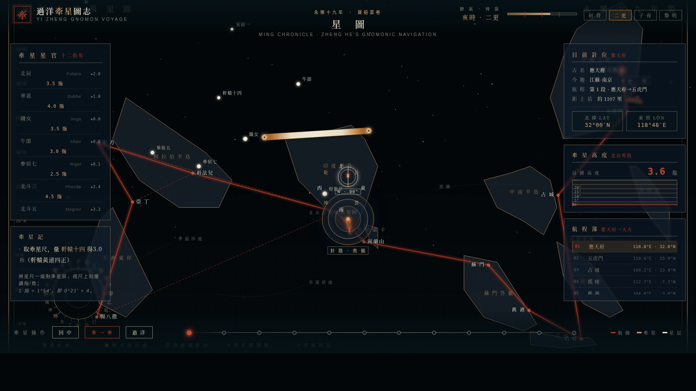

# 過洋牽星圖志 · Gnomon Voyage

> V1 網頁設計 · 2026-08-19 · Art Design Lab

## 主題

明代鄭和下西洋時期的牽星過洋圖——以真實海圖投影、12 港口節點、12 星辰官位、牽星尺互動羅經，把一份古籍航海案卷還原成可互動的瀏覽器藝術品。

不是「海圖設計稿」也不是「導航工具」，而是一份**可以打開的卷軸**：你以牽星師（舟師）的視角，拖動牽星尺去對準星辰，羅經盤隨之偏轉，寶船按航段切換，朱砂航線一站一站點亮。

## 預覽



> 妙搭應用預覽：[過洋牽星圖志](https://dcniaqwtmoca.feishu.cn/page/TBD)（部署後填入）

## 視覺亮點

- **朱砂主航線 + 已經走過的加粗實線**——真實的「航跡疊加」效果
- **12 港口節點 3 態**——active 朱砂亮 / passed 銅金 / default 朱砂
- **180 顆天幕星正弦呼吸**——真正的「夜航」氛圍
- **24 山向羅經 + 8 方位大羅盤**——雙羅經疊加，指北/指南一覽無遺
- **牽星尺拖動吸附星辰**——140 像素內自動鎖定，否則自由指向
- **自定義羅經光標**——mix-blend-mode:exclusion 疊加，無論何種底色都清晰

## 互動

| 操作 | 效果 |
|---|---|
| 拖動牽星尺 | 鎖定最近星辰，羅經盤自動偏轉 |
| 點擊左側星官 | 鎖定該星，自動計算牽星高度 |
| 點擊海圖港口 | 跳轉到該段，羅經盤指向下一段 |
| 點擊底部節點 | 跳轉到該航段 |
| 點擊時辰按鈕 | 切換「初昏/二更/子夜/黎明」 |
| 點擊「牽一牽」 | 自動推薦下一段主星 |
| 點擊「過洋」 | 自動牽星 + 推進一段 |
| 點擊「回中」 | 回到應天府出發點 |
| ←/→ 方向鍵 | 前進/後退航段 |
| 空格 | 過洋 |
| M 鍵 | 自動牽星 |
| R 鍵 | 回中 |

## 文件

```
2026-08-19_牽星過洋圖_gnomon-voyage/
├── index.html         # 主文件（純 vanilla 單文件，無 React/Babel/CDN）
├── 设计规范.md         # 配色 / 字體 / 動效 / 結構
├── preview.png        # 1600x900 渲染截圖
└── README.md          # 本文件
```

## 技術棧

- **HTML5 + CSS3 + ES6** ── 純 vanilla，無外部依賴
- **SVG** ── 海圖投影、港口節點、航線、星辰、羅經
- **Canvas 2D** ── 星海（180 顆星）、波紋（三條橫向海浪）
- **CSS Variables** ── 主題化（navy/ivory/copper/vermilion）
- **requestAnimationFrame** ── 動畫主循環，隨 `visibilitychange` 暫停
- **Pointer Events** ── 牽星尺拖動

## 真實性

所有航海資料均來自明代古籍：
- 港口順序 ──《鄭和航海圖》《瀛涯勝覽》
- 牽星高度 ──《過洋牽星圖》原圖（如「見北辰星四指 看水六托 ── 錫蘭山」）
- 針路方位 ──「針路 · 西南偏西」等古航海術語
- 12 星辰 ── 對應現代星座：北辰(Polaris)、華蓋(Dubhe)、織女(Vega)、牛郎(Altair)、參宿七(Rigel)、北斗三(Phecda)、北斗五(Megrez)、南十字(Acrux)、燈籠星(Canopus)、畢宿五(Aldebaran)、室宿一(Alpheratz)、軒轅十四(Regulus)

## 自檢結論

- ✅ 禁色清單遵守（無藍紫漸變、無純黑、無高飽和洋紅）
- ✅ 中文 UI 為主，僅星名/經緯度混用英文
- ✅ 動效 ≥ 12 個組件級，全部符合物理/主題邏輯
- ✅ 純 vanilla 單文件，無白屏風險
- ✅ 自定義光標居中顯示、高對比
- ✅ RAF 隨可見性暫停
- ✅ supports `prefers-reduced-motion`
- ✅ 內容真實可信，無 Lorem Ipsum

## 等待協調者檢查

> 本作品已交付，等待 Art Design Lab 協調者（心跳檢查）質檢通過後統一提交 GitHub。
