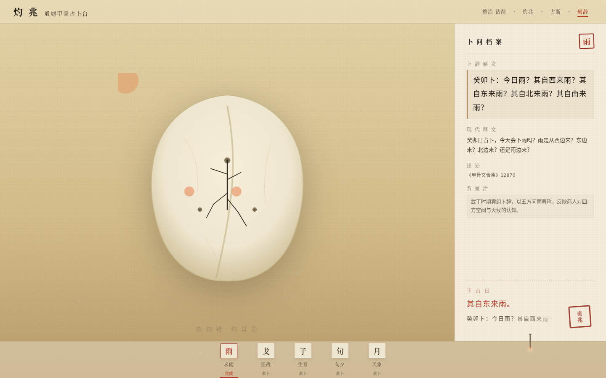

# 灼兆 · 殷墟甲骨占卜台

> V1 网页设计 · 2026-08-19

## 主题
殷墟甲骨灼兆占卜台。整站是一座固定的贞人祭坛——执青铜灼锥，灼烧骨版钻凿凹位，兆纹当面迸裂生长，贞人据兆占断、朱砂判词与刻辞显现。「灼→裂→断」的因果链即占卜本身。

## 简介
不是展示页，是一场可亲身完成的三千年前占卜。开页居中的青铜灼锥光标即你的手；拖它抵入骨版钻凿点、按住蓄热，兆纹（卜字形裂纹）当面迸裂分叉生长；兆成之后，「王占曰」判词朱砂填入、印章盖下、刻辞逐字显现。五块甲骨分别对应求雨、征战、生育、旬夕、天象五则真实卜辞，全部兆成后浮现结语「五兆既成，契于龟甲」。

核心交互记忆点：蓄热的静默 → 裂纹炸开的分叉生长 → 「王占曰」朱砂落定——全站唯一的高对比强动效时刻，其余区域保持安静。

## 截图

## 妙搭预览
https://dcniaqwtmoca.feishu.cn/page/LuOxmz29cdwyohaHQxrc9i1Mn9c

## 文件说明
- `index.html` — 单文件完整实现（HTML + 内联 CSS + 原生 JS，57.5KB）
- `设计规范.md` — 配色体系、字体栈、动效系统、交互机制、内容、健壮性
- `preview.png` — 兆成后舞台截图

## 技术栈
纯 vanilla 单文件，零外部依赖。骨版、钻凿点、兆纹、图标全部内联 SVG；字体走系统字栈（宋体/楷体/无衬线/等宽）；WebAudio 程序生成蓄热低嗡与裂帛爆点，无音频文件。requestAnimationFrame 蓄热，visibilitychange 暂停，prefers-reduced-motion 降级。

## 内容真实性
五则卜辞均取自学界通行著录《甲骨文合集》：
- 求雨 12870（宾组·武丁，五方问雨）
- 征战 6412（妇好伐土方）
- 生育 14002（妇好娩，四段式俱全）
- 旬夕 6057（旬亡祸，沚戛告急，叙命占验范本）
- 天象 11482（乙酉夕月有食，最早月食记录之一）

## 自查（删动画 / 灰度 / 轮廓）
- 删除全部动画：骨版 / 档案 / 索引三区版面关系仍成立（靠空间与明度，不靠动效）。
- 灰度：去掉朱砂橙后，靠明度差与尺寸差仍能区分判词 / 卜辞 / 释文 / 编号。
- 轮廓：与近 20 作（长卷 / 剖面 / 轮盘 / 戏台 / 档案索引）无轮廓相似——固定祭坛 + 灼锥蓄热-裂纹因果生成，是历史指纹中缺席的机制。
