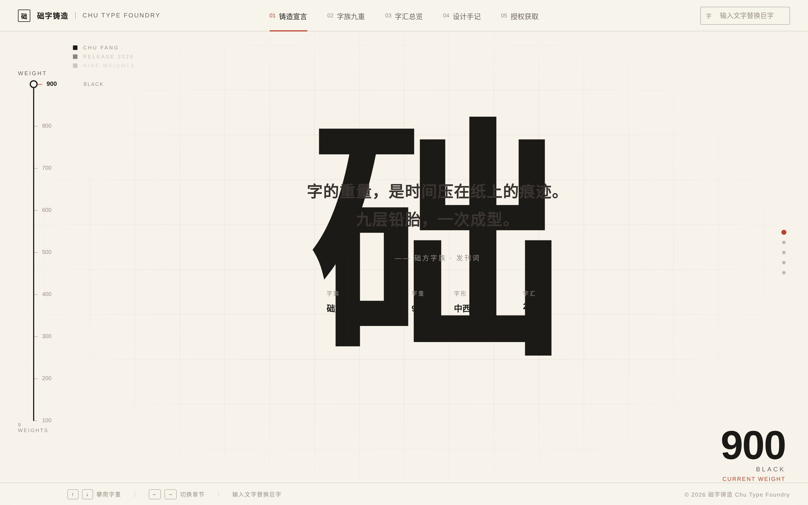

# 础字铸造 · 础方字族发布站

> 独立字体铸造厂「础字铸造」发布中西文协调字族「础方」九字重的品牌官网

---

## 主题

**亲手掂量一个字族的重量**

以全屏中央巨字 + 左侧垂直字重轴为核心，用户沿字重轴从 Hairline 攀爬至 Black，
亲历九档字重的气质变迁——从发丝般的留白克制，到浓墨重笔的力量感。
键盘 ↑↓ 是第一公民，轴柄拖动与章节点击为无障碍次级路径。

---

## 项目简介

础字铸造（Chu Type Foundry）是一家专注于中西文协调字族的独立字体工作室。
本站是其首发字族「础方」（Chu Fang）的品牌发布页。

不同于传统字体展示站的罗列方式，本站将「字重」本身变成了浏览方式——
字重不仅是字体的属性，更是阅读节奏的调节器。攀爬字重，就是翻阅一本活的字体样书。

### 核心特性

- **垂直字重轴**：九档刻度，键盘 ↑↓ 攀爬，轴柄可拖
- **全屏巨字舞台**：单一字符恒居正中，随字重实时变形
- **五章叙事**：铸造宣言 → 字族九重 → 字汇总览 → 设计手记 → 授权获取
- **字重感应内容**：章节标题 / 正文随当前字重变化气质
- **即输即换**：输入框实时替换中央巨字
- **纯单文件**：零依赖、零外部加载、零白屏

---

## 预览



**在线预览**：https://dcniaqwtmoca.feishu.cn/page/WhCLmyALTdQuotaHd3pcgP1Dn3g（妙搭预览链接）

---

## 文件说明

```
2026-08-19_础字铸造_weight-axis/
├── index.html          # 主页面（单文件，含全部 CSS / JS）
├── 设计规范.md          # 设计规范文档（色彩 / 字体 / 动效 / 空间 / 交互）
├── README.md           # 本文件
└── preview.png         # 预览截图
```

---

## 技术栈

| 类别 | 选型 | 说明 |
|------|------|------|
| 语言 | 纯 Vanilla HTML + CSS + JS | 无框架、无构建、无依赖 |
| 字体 | 系统无衬线字体栈 | 不加载外部字体，零白屏风险 |
| 字重效果 | CSS `font-weight` + `-webkit-text-stroke` | 纯 CSS 实现 9 档字重视觉 |
| 动效 | CSS transition + JS RAF | 15 个组件级特效，物理感统一 |
| 响应式 | CSS clamp / media queries | 1440 / 1024 / 768 / 390 四档 |
| 无障碍 | 键盘全路径 + prefers-reduced-motion + 触摸支持 | 符合基础无障碍标准 |

### 工程保障

- ✅ 零未定义引用
- ✅ RAF / 定时器随页面可见性暂停，卸载时取消
- ✅ 快速操作不叠加定时器（长按攀爬有清理机制）
- ✅ 高频鼠标事件（光标）使用 RAF 节流，直接操作 DOM
- ✅ 支持 `prefers-reduced-motion` 全面降级
- ✅ 单文件 HTML，无外部资源加载失败风险

---

## 使用说明

### 键盘操作（推荐）

| 按键 | 功能 |
|------|------|
| ↑ | 沿字重轴向上攀爬（字重增加） |
| ↓ | 沿字重轴向下攀爬（字重减小） |
| ← | 切换到上一章节 |
| → | 切换到下一章节 |

### 鼠标 / 触摸操作

- **拖动轴柄**：按住左侧轴柄上下拖动
- **点击刻度**：直接跳转到对应字重
- **点击章节**：顶部导航标签或右侧圆点
- **点击字汇**：在「字汇总览」中点击字符替换巨字
- **输入文字**：右上角输入框实时替换中央巨字

### 九档字重

| 档位 | 数值 | 英文名称 | 中文标签 |
|------|------|----------|----------|
| 01 | 100 | Hairline | 发丝 |
| 02 | 200 | Thin | 细 |
| 03 | 300 | Light | 轻 |
| 04 | 400 | Regular | 常规 |
| 05 | 500 | Medium | 适中 |
| 06 | 600 | Semibold | 半粗 |
| 07 | 700 | Bold | 粗 |
| 08 | 800 | Extra Bold | 特粗 |
| 09 | 900 | Black | 浓墨 |

---

## 设计亮点

1. **字重即交互**：把字体属性变成了浏览方式本身，而非仅供选择的参数
2. **整体重量感**：字重变化时，巨字、标题、正文、数字全部同步迁移，整屏气质一致
3. **铅字浇铸动效**：字重过渡采用 cubic-bezier 缓动，模拟金属液凝固的重量感
4. **细字描边补偿**：字重越细，-webkit-text-stroke 越宽，保证细字在屏幕上的可见性
5. **印刷校样视觉体系**：校样格、刻度标尺、方块印记，整体气质从活字铸造室生长出来
6. **三色克制**：纸白 + 墨黑 + 砖红，不加多余色彩，让字形本身成为主角
