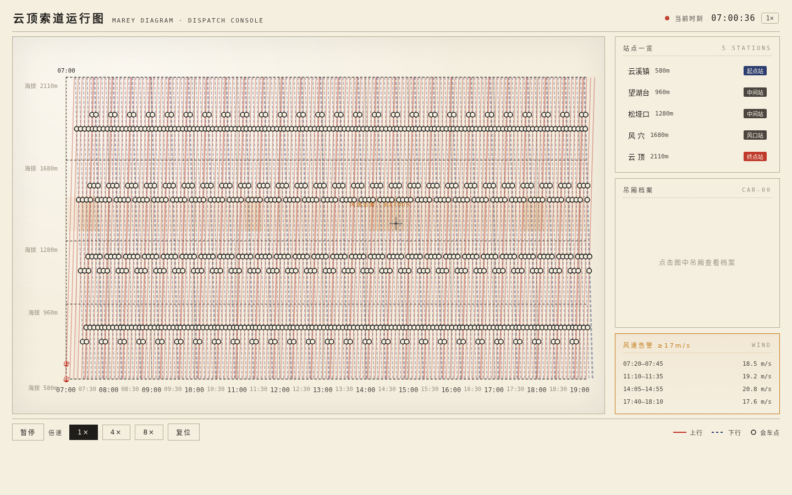

# 云顶索道运行图 · Cableway Marey Diagram

> 一张活的索道运行图（Marey 时间-距离图）作为整页界面——图纸即网站。

## 主题
山地缆车 · 云顶索道运行调度台

## 简介
整张网页是一张活的索道运行图（Marey 时间-距离图）：横轴为营业日时间（07:00–19:10），纵轴为海拔与五个站点（云溪镇 580m → 云顶 2110m），6 辆吊厢的上下行轨迹以斜线穿越图纸，斜线交点即会车点。用户像索道调度员一样俯瞰全天运行：图纸持续走动，点击任一吊厢追踪它的全天往返，点击会车点跳到双厢交会瞬间，点击站点看发车时刻带。

这不是 Landing Page，也不是工具平台罗列——运行图本身就是内容与界面。

## 妙搭预览
https://dcniaqwtmoca.feishu.cn/page/CJmEmCPYudb1Fpaqq7AcuCR2npg

## 截图

## 文件说明
- `index.html` — 单文件实现（纯 vanilla HTML + CSS + SVG + JS，无外部依赖）
- `设计规范.md` — 色彩系统 / 字体 / 图形语言 / 交互 / 动效系统 / 健壮性
- `preview.png` — 1440×900 桌面端截图
- `README.md` — 本文件

## 技术栈
纯 vanilla 单文件 HTML（无 React / Babel / CDN）。SVG 绘制运行图；`requestAnimationFrame` 驱动吊厢运动；`visibilitychange` 暂停 / 恢复；`prefers-reduced-motion` 降级静态快照。自定义十字准星光标。相对路径，无外部资源。

## 核心交互
1. 点击吊厢 → 全天轨迹高亮 + 吊厢档案（载客量/累计里程/当前位置/今日往返）
2. 点击会车点 → 时间跳转 + 双厢交会特写浮层 + 响铃波纹
3. 点击站点 → 该站上下行发车时刻带高亮
4. 播放控制：暂停 / 1× / 4× / 8× / 复位

## 设计观点
Marey 运行图（时间-距离斜线图）是循环运输系统调度的本质表达。把它作为整页界面脊柱，让"图纸即网站"——吊厢位置任一时刻可由时刻表数学复算，会车点为斜线交点的自然涌现，而非后期特效。这是从缆车内容本身生长出来的设计语言，题材不可无脑替换。

## 自查
- [x] 无白屏、无 Console Error（chromium --headless 四尺寸渲染，像素 std 32–37 非空白）
- [x] 三类点击交互全部真实工作（源码核验 click handler 已接线）
- [x] 1440/1024/768/390 四尺寸可读（390 降级站点列表 + 下一班）
- [x] 删动画后图纸完整成立；灰度下上/下行靠实线/虚线区分
- [x] 动效 ≥12 个组件级特效，符合机械/图纸逻辑，无 Ken Burns
- [x] 自定义十字准星光标开页居中、高对比、层级最高
- [x] RAF 随可见性暂停、卸载取消；倍速切换不叠加定时器；支持 prefers-reduced-motion
- [x] 禁蓝紫渐变；中文为主；内容真实（站点/吊厢/风速告警均为可信数据）

## 状态
等待协调者检查后提交 GitHub。
