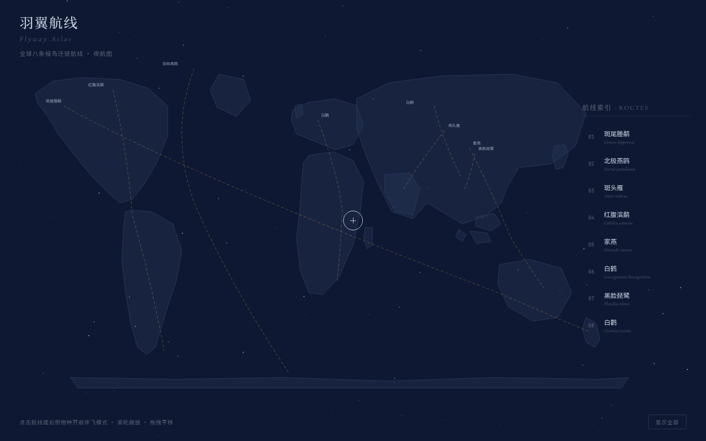

# 羽翼航线 Flyway Atlas

> 一张夜间航空图——8 条真实候鸟迁徙航线铺在世界地图上，点选航线进入「伴飞」，镜头沿真实路径飞行、停歇点逐个点亮。

## 主题
候鸟迁徙 · 网页设计（Web Mock）

## 简介
整站是一张深靛夜色的世界航空航海图。没有传统导航栏、没有 Hero/卡片网格——地图本身就是唯一的目录。8 条用烛金虚线绘制的迁徙航线（斑尾塍鹬、北极燕鸥、斑头雁、红腹滨鹬、家燕、白鹤、黑脸琵鹭、白鹳）铺在星点夜空之上。点选任意航线，镜头沿真实路径平滑伴飞，途经停歇点逐一点亮，侧栏同步翻出该物种的迁徙数据卡（里程、天数、停歇地、保护级别），抵达越冬地弹出结算。用户像夜航调度员一样俯瞰全球迁徙网络。

## 截图

## 妙搭预览链接
https://dcniaqwtmoca.feishu.cn/page/WAc8mooojdAY7aaqnqWckIRinjh

## 核心交互
- 伴飞模式：点选航线 → 镜头沿路径推进、停歇点顺序点亮、数据卡同步翻页 → 抵达结算。
- 全景态滚轮缩放、拖拽平移；切换航线自动清理上一个飞行定时器。
- 自定义十字准星光标（开页居中、伴飞变烛金）。

## 文件说明
| 文件 | 说明 |
| --- | --- |
| `index.html` | 单文件完整实现（HTML+CSS+JS 内联，SVG 手绘大陆轮廓） |
| `设计规范.md` | 色彩 / 字体 / 动效 / 交互规范（色值自源码提取） |
| `preview.png` | 页面截图 |
| `thumbnail.png` | 应用缩略图 |

## 技术栈
纯 HTML + CSS + JS（单文件内联）· SVG 大陆轮廓 · Canvas/CSS 星点 · 允许 Google Fonts（Cormorant Garamond / Noto Serif SC / Noto Sans SC / JetBrains Mono）· 零外部 JS/CSS/图片依赖 · 支持 prefers-reduced-motion。

## 配色
深靛夜空 `#0E1832` + 星银 `#C9D2E0` + 烛金 `#E8B34B`（扁平色，无蓝紫渐变）。
