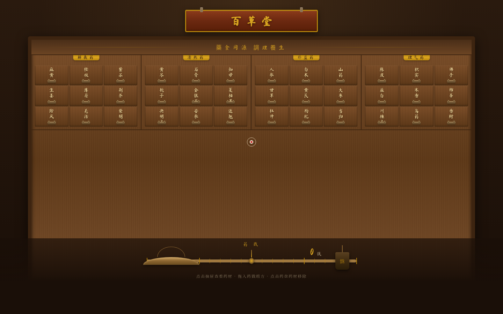
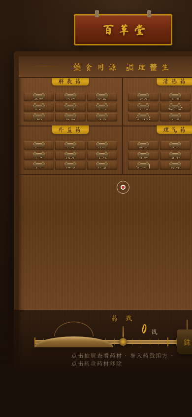

# 老药铺 · 百子柜

**类别**：Web Mock　**日期**：2026-08-19

## 简介

整个网站是一面传统中药百子柜墙。抽屉即导航索引——按药性分类排列的 36 格柜面，向下拖拽抽屉拉手，抽屉滑出揭示该味药材的 SVG 手绘标本与药性档案（性味、归经、功效、主治、用量、禁忌）。用户可将多味药拖入底部药戥（戥子秤）组方，秤杆实时平衡显示总重量，寒温并用时朱砂警示配伍禁忌。

## 主题

传统中药铺百子柜——药性档案与组方体验。柜墙索引为唯一导航空间模型，不做传统顶部导航/Hero/Footer。

## 截图

## 妙搭预览链接

https://dcniaqwtmoca.feishu.cn/page/XfrxmZ0MSdCQ7AaCuEQcef8VnTg

## 文件说明

| 文件 | 说明 |
|------|------|
| index.html | 单文件 vanilla HTML/CSS/JS，含全部样式、交互逻辑、药材数据、SVG 标本 |
| preview.png | 桌面端 1440×900 截图 |
| preview_mobile.png | 移动端 390×844 截图 |
| 设计规范.md | 从源码提取的真实色值、字体、动效系统 |

## 技术栈

- 纯 vanilla 单文件 HTML + CSS + JS，无 React/Babel/CDN 依赖
- SVG 手绘药材标本（12 味，每味独立绘制）
- CSS 变量驱动主题色系
- requestAnimationFrame 驱动自定义光标
- prefers-reduced-motion 降级支持
- visibilitychange 暂停/恢复 RAF

## 12 味真实药材

解表药：麻黄、薄荷、柴胡
清热药：黄芩、金银花、连翘
补益药：人参、黄芪、当归
理气药：陈皮、木香、香附

每味药材含完整药性数据：性味、归经、功效、主治、用量、禁忌。

## 设计观点

柜墙索引空间模型——整页就是柜面，不做传统网页结构。抽屉拉出是核心交互记忆点，药戥组方赋予产品逻辑深度。配色取自真实药铺材质：栗棕木柜、黄铜拉手、米黄药签纸、朱砂批注、墨绿药液。
