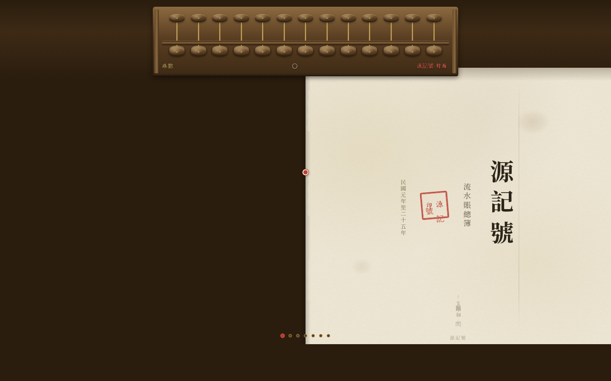

# 老账房·珠算志 — 网页设计 Mock

> 一册竖排老账簿，一支十三档算盘：拨动算珠，账页随纪年翻篇。

## 预览

**妙搭在线预览**：https://dcniaqwtmoca.feishu.cn/page/Hmd1mXF1YdF13EaXrPhcpjH5nIC

## 项目信息

- **类别**：V1 网页设计（web_mock）
- **主题**：民国老账房的账簿与珠算
- **核心创意**：算盘 = 全站唯一导航。拨动最右两档算珠（个位/十位），账簿实时换算纪年，竖排账页随之翻篇
- **风格**：账本米白 `#F2EBD8` / 朱砂 `#B83A2E` / 胡桃棕 `#8B6A3F` / 旧金 `#B8964A`

## 体验方式

1. 打开页面，一支 13 档算盘横在账簿之上
2. 拖拽**最右两档**算珠（下珠上拨、上珠下拨），数值以大写数字实时跳动
3. 数值跨过页阈值，竖排账页翻篇——从「民國元年」一路翻到「民國七年」
4. 松手时算珠吸附回梁，带木质吸附声（Web Audio 合成）
5. 每页是商号「源記號」该年的真实感账目（纹银、洋元、厘毫，上收下支）

## 文件说明

| 文件 | 说明 |
|------|------|
| `index.html` | 完整单文件实现（57KB，内联样式脚本，零外部依赖） |
| `设计规范.md` | 色彩 / 排版 / 交互 / 动效系统详解 |
| `preview.png` | 页面截图 |
| `README.md` | 本文件 |

## 技术栈

- 纯原生 HTML/CSS/JS 单文件，无框架无 CDN
- 竖排版式：`writing-mode: vertical-rl`（14 处），从右往左阅读
- 拖拽：事件委托 + RAF dragLoop + 松手吸附 + Web Audio 音效
- 自定义光标：开页居中、高对比、层级最高
- 健壮性：RAF 随可见性暂停、`prefers-reduced-motion` 降级、零未定义引用

## 质量记录

- Browser QA：4 个宽度无横向溢出、零 Console Error、零 404、截图像素 std 89.8
- 深度交互验证：拨最右档下珠 80px → 数值「一」→ 纪年「民國元年」翻页成功
- Quality Gate：PASS（Contract Fidelity = FULL）
- 已知 minor：装饰档（左 11 档）拖拽有跟手动画但不计值，初次使用者或需摸索

---

*Art Director 决策：batch11 / 2026-08-19*
