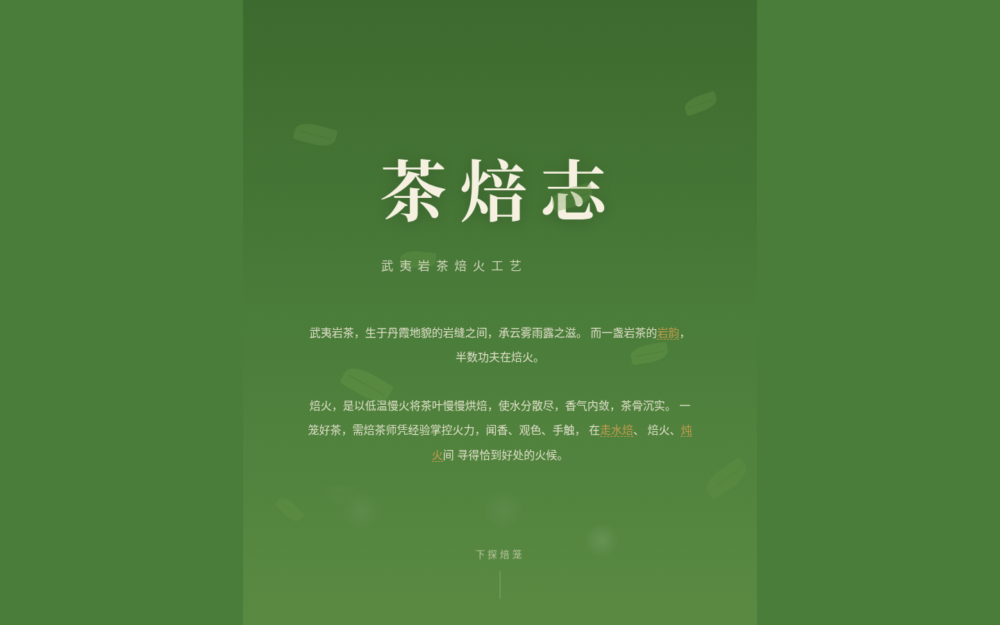

# 茶焙志 · 武夷岩茶焙火工艺

## 主题

武夷岩茶焙火工艺交互体验——以焙笼垂直剖面为空间模型的热力梯度网站。

## 简介

茶焙志将武夷岩茶的焙火工艺转化为一次垂直向下的空间探索。用户从顶部鲜叶层开始，逐层深入焙笼内部：走水焙去青气、焙火定香型、炖火渗茶骨、热气升腾、炭火控温，最终到达退火静置与岩骨花香的收尾。

核心交互「拨灰控火」位于炭火层——用户在 Canvas 灰烬层上拖动拨开灰烬，暴露下方炭块，火力随之转旺，温度从 70°C 升至 140°C，烟雾增浓、火星迸溅加剧，6 个焙火阶段的文字描述实时切换。

## 截图

## 妙搭预览

https://dcniaqwtmoca.feishu.cn/page/SSDym0zutd70s5a5tqOcCed9nOf

## 文件说明

| 文件 | 说明 |
|------|------|
| `index.html` | 完整源码（纯 vanilla 单文件，无外部依赖） |
| `设计规范.md` | 配色系统、字体系统、空间模型、动效系统、内容真实度 |
| `preview.png` | 炭火层交互区截图（1440×900） |
| `README.md` | 本文件 |

## 技术栈

- **纯 vanilla 单文件**：无 React / Babel / CDN 依赖，HTML + CSS + JavaScript 全部内联
- **Canvas 2D**：烟雾粒子系统、灰烬拨动交互
- **CSS Custom Properties**：15 个色值变量 + 火力强度变量
- **requestAnimationFrame**：光标、滚动、烟雾、脉动动画
- **响应式**：4 断点（1440 / 1024 / 768 / 480px）
- **无障碍**：prefers-reduced-motion 支持、触屏设备适配、passive 事件监听

## 设计决策

- **空间模型**：焙笼纵剖面 = 9 层深度，颜色 = 温度梯度
- **配色**：热力梯度（绿→琥珀→棕→炭黑→余烬橙），禁蓝紫渐变
- **母题**：heat_gradient_as_depth——滚动即降温/升温体验
- **反模板**：非 Landing Page、非卡片网格、非通用茶叶网站
