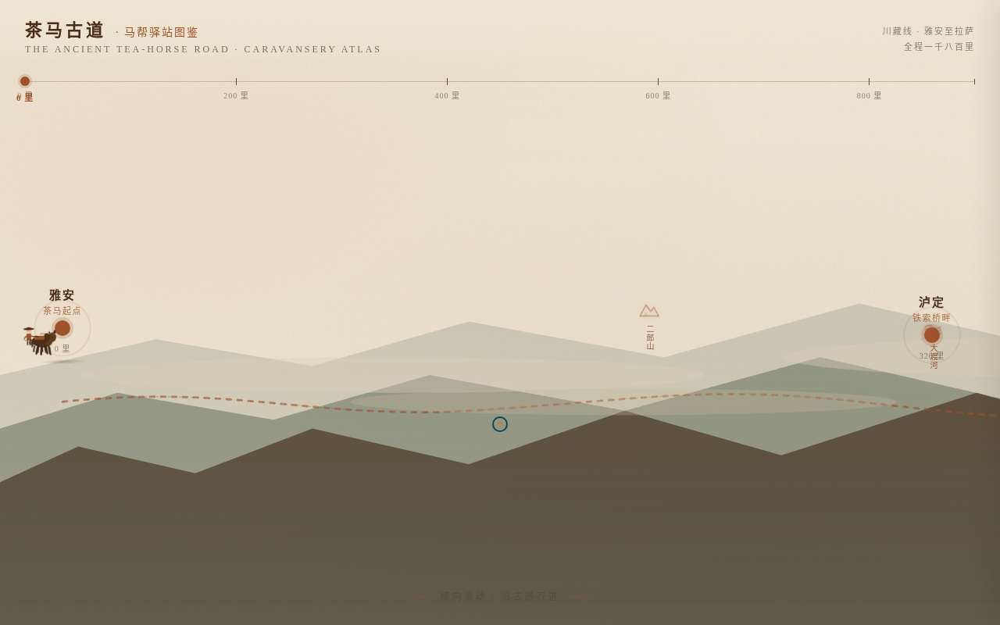

# 茶马古道·马帮驿站图鉴

> 类别：Web Mock　日期：2026-08-19　主题：茶马古道马帮驿站横向长卷

## 简介

「茶马古道·马帮驿站图鉴」是 Art 设计实验室 V1 网页作品。整站是一条可横向滚动的茶马古道山道长卷——滚动即马帮行路，沿途 7 个驿站节点（雅安→泸定→康定→理塘→巴塘→昌都→拉萨）是信息入口，顶部里程标尺（0–1800 里）同步标记当前行路里程。马帮图示（驮马 + 马锅头）随滚动沿山道行进，走到险段（溜索渡江 / 雪山垭口）山道变窄并出现警示。空间模型 `horizontal_mountain_trail_scroll` 为全新模式，未与历史作品重复。

## 截图

## 妙搭预览链接

https://dcniaqwtmoca.feishu.cn/page/YnNmmmweQdFEGtaVkdocqBQwnob

## 文件说明

- `index.html` — 单文件源码（HTML+CSS+JS，约 56KB）
- `preview.png` — 浏览器渲染截图
- `thumbnail.png` — 妙搭自动缩略图
- `设计规范.md` — 色值 / 字体 / 动效系统 / 核心交互

## 技术栈

纯 vanilla 单文件 HTML+CSS+JS，无 React/Babel/CDN，所有资源内联。自定义光标开页居中，RAF 随 `document.hidden` 暂停、卸载取消，支持 `prefers-reduced-motion`。配色：赭石红 / 茶褐 / 松烟绿 / 雾灰 / 宣纸米（禁蓝紫渐变）。

## 设计要点

- 横向长卷为主轴，纵向信息以驿站卡片嵌入山道
- 山道 SVG + 雾气分层表达横断山势，三层山体视差
- 7 驿站可点击聚焦展开（马帮规模 / 货物 / 客栈 / 前方险段 / 行记短文）
- 里程标尺随滚动同步，马帮随滚动位移 + 颠簸步伐
- ≥12 组件级动效，符合古道行路逻辑
