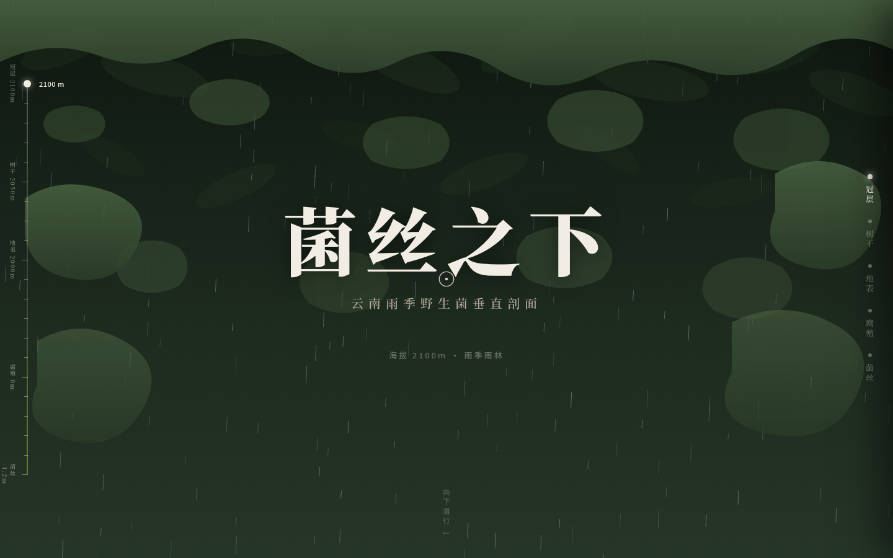

# 菌丝之下 · 云南雨季菌物垂直剖面

## 项目简介
「菌丝之下」是 Art 设计实验室 V1 网页设计作品。整页是一张不断裂的森林垂直剖面长卷：滚动即从雨季雨林冠层一路下潜，穿过树干、地表落叶层、腐殖层，最终抵达地下菌丝网络。6 种真实云南菌物（鸡枞、松茸、美味牛肝菌、见手青、青头菌、干巴菌）嵌在各自生态位，可点击查看识别卡。主题思想：菌子只是地下菌丝网络结出的果实。

## 截图

## 妙搭预览
https://dcniaqwtmoca.feishu.cn/page/VL5qmXeZBdUV14aWTQ9cyPASn4c

## 文件说明
- `index.html` — 单文件实现（HTML+CSS+JS 内联，含全部 SVG 剖面绘制）
- `设计规范.md` — 色值、字体、动效系统、交互记忆点
- `preview.png` — 首屏截图

## 技术栈
纯 vanilla 单文件，无 React/Babel/CDN，全部 SVG/CSS/Canvas 绘制，零外部图片。RAF/定时器随 visibilitychange 暂停且卸载取消；支持 prefers-reduced-motion。响应式 1440/1024/768/390px，无横向溢出。

## 设计要点
- 空间模型：连续垂直剖面（非 section 堆叠、非卡片网格）
- 贯穿深度标尺（海拔 2100m → 深度 -1.2m）实时跟随滚动
- 自定义光标（采集小刀/放大镜）开页居中、高对比
- signature：地下菌丝荧光网络随滚动逐段点亮
- 配色：墨绿冠层 × 腐殖棕 × 荧光菌丝绿 × 朱红慎食标记（非蓝紫渐变）

## 自查结论
Browser QA（Chromium headless 1440/1024/768/390）：零 Console Error、零 pageerror、零失败资源、零横向溢出，截图非空白。删动画静态成立，灰度下层级成立，轮廓与近期作品不重复。
