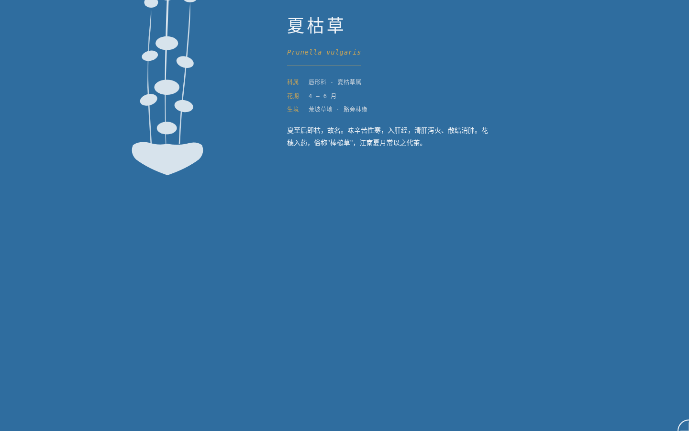

# 蓝晒植物志 · Cyanotype Botanical

> 2026-08-19 · V1 网页设计

## 主题

**蓝晒植物志** —— 一座可滚动的虚拟植物标本馆，以蓝晒法（Cyanotype）化学显影为空间隐喻：向下滚动即模拟 UV 光线对感光纸的持续曝光，页面色彩随曝光时长从奶油色渐变至普鲁士蓝，植物剪影在"显影"过程中逐株浮现。

## 简介

这不是一张设计稿，而是一个真实可交互的完整网站。核心交互模型 `scroll_as_exposure`（滚动即曝光）在 153 件历史作品中从未使用过——滚动深度直接映射蓝晒工艺的曝光时长，驱动一套五阶连续色彩插值系统：

- **曝光 0%**（页面顶部）：奶油纸色 `#F5F0E1`，植物剪影不可见
- **曝光 25%**：暖米色 `#E8DCC4`，首批植物开始显影
- **曝光 50%**：灰青色 `#7A9EA8`，剪影轮廓清晰
- **曝光 75%**：深普鲁士蓝 `#1B3A5C`，剪影变为奶白高对比
- **曝光 100%**（页面底部）：饱和普鲁士蓝 `#0A2540`，终章卡片完整显影

12 株植物各有真实的拉丁学名、科属、采集地与形态特征描述，散布在长卷中，随滚动逐株"显影"显现。终章以三张蓝晒工艺科普卡收尾。

## 截图展示

*页面滚动至约 75% 曝光处——普鲁士蓝底色与奶白植物剪影形成典型蓝晒高对比。*

## 妙搭预览链接

https://dcniaqwtmoca.feishu.cn/page/BX6WmNJn0d65RWaDOnHcDUcqnWb

## 文件说明

| 文件 | 说明 |
|------|------|
| `index.html` | 完整源码，纯 vanilla 单文件（无 React / Babel / CDN） |
| `preview.png` | 浏览器 QA 截图（夏季曝光段，1440×900） |
| `thumbnail.png` | 妙搭应用缩略图 |
| `设计规范.md` | 色彩系统、字体系统、光标规格、植物数据、动效系统、技术栈 |
| `README.md` | 本文件 |

## 技术栈

- **纯 Vanilla 单文件 HTML**（HTML + CSS + JS 内联，零外部依赖，零构建步骤）
- **自定义光标**：蓝晒放大镜（loupe），固定十字准星，`mousemove` 直接操作 DOM 不经 RAF
- **五阶色彩插值**：`lerpColor()` + `getColorAt()` 对 RGB 分量做连续线性插值，随 `scrollTop / scrollMax` 实时更新 CSS 变量
- **植物显影**：被动 `scroll` 监听器 + `requestAnimationFrame` + `ticking` 标志，按曝光阈值逐株揭示
- **健壮性红线**：`prefers-reduced-motion` 降级（动画归零 + 强制显影）、`visibilitychange` 暂停全部 CSS 动画、RAF/定时器随可见性暂停且卸载取消、快速操作不叠加定时器、高频鼠标事件直接操作 DOM

## 动效系统（≥12 个组件级特效）

1. 五阶连续背景色插值（滚动驱动）
2. 五阶连续文字色插值
3. 五阶连续剪影色插值
4. 植物剪影逐株显影（opacity + scale 过渡）
5. 植物剪影悬停微缩放
6. 终章卡片逐张显影
7. 放大镜光标实时跟随（直接 DOM）
8. 放大镜十字准星
9. 导航栏曝光联动
10. 进度条曝光填充
11. 标题入场淡入
12. 响应式布局切换过渡

---

**流水线状态**：Art Director ✓ → Designer ✓ → Browser QA ✓（0 错误）→ Critic ✓（Contract Fidelity: FULL）→ Quality Gate ✓（PASS）→ Memory Writer ✓

**等待协调者检查后提交 GitHub。**
