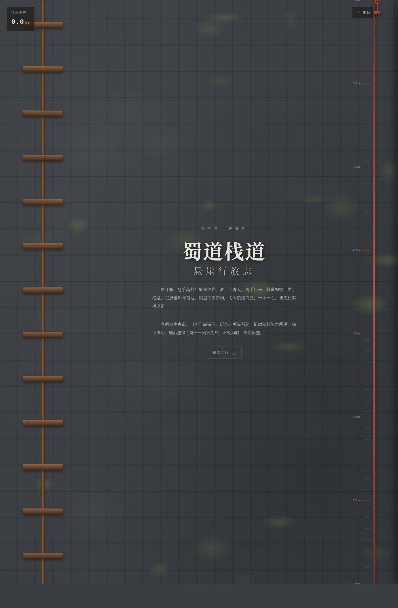

# 蜀道栈道·悬崖行旅志

> Art 设计实验室 · V1 网页设计 · 2026-08-19

## 主题
古蜀道（金牛道）栈道与悬崖行旅文化志。网页即一面风化悬崖，用户向下滚动即在崖壁上攀降行旅，关隘、摩崖石刻、古客栈贴壁而立。

## 简介
不是 Landing Page、不是工具平台。空间模型为 `vertical_cliff_plank_descent_index`：固定全屏悬崖多层视差背景，栈道与站点贴壁下移；右侧锈蚀铁索随滚动深度下移并按速度摆动，底部铁锚为进度指针。核心记忆点是摩崖石刻"拓印"揭示——点击站点，崖壁石刻文字以墨拓效果"拓"出，右侧滑出行旅札记。8 处真实蜀道站点（剑门关 / 明月峡 / 翠云廊 / 昭化古城 / 朝天关 / 千佛崖 / 皇泽寺 / 金牛道），各含里程、海拔、札记、摩崖释文。

## 截图

## 妙搭预览链接
https://dcniaqwtmoca.feishu.cn/page/M0DcmIj1OdmPF1akvkxcuUstnpf

## 文件说明
- `index.html` — 单文件应用（vanilla，HTML+CSS+JS 内联）
- `设计规范.md` — 配色 / 字体 / 动效系统 / 空间模型
- `preview.png` — 浏览器渲染截图（1440×2200）
- `thumbnail.png` — 妙搭平台缩略图

## 技术栈
纯 vanilla 单 HTML 文件，无 React/Babel/CDN。requestAnimationFrame 驱动视差与光标，visibilitychange 暂停，prefers-reduced-motion 降级。

## 自检结论
- 删动效结构仍成立（垂直崖壁站点阅读独立于动画）
- 灰度下信息层级成立（靠空间/尺寸/对比而非颜色）
- 轮廓与横向 trail / card grid 明显不同
- Browser QA：0 Console Error / 0 资源失败 / 截图非空白
