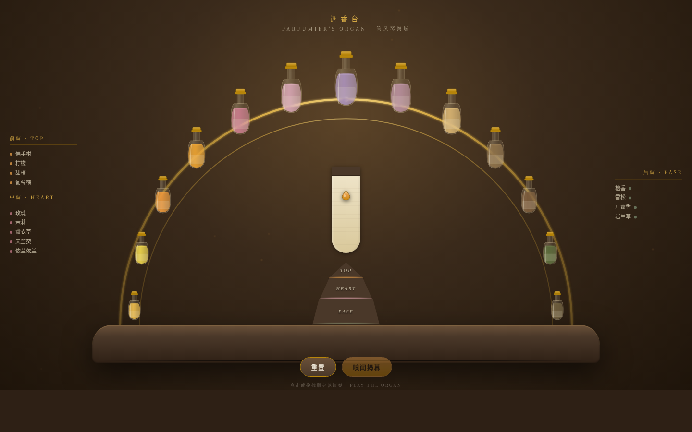

# 调香台·香水管风琴祭坛

> V1 网页设计 · 2026-08-19

## 主题
香水管风琴祭坛——演奏精油瓶释放香调，在试香条上组成配方，金字塔前/中/后调渐满。

## 简介
整站是一座调香师管风琴：13 瓶精油沿黄铜拱弧排列如音管，中央高两侧低。点击或拖拽「演奏」瓶身，金色液滴从瓶底滴落至羊皮试香条，留下对应调性的晕染斑迹；金字塔三阶（前调琥珀 / 中调玫瑰 / 后调鼠尾草）按调性实时归位渐满。演奏 ≥3 种精油后可「嗅闻揭幕」，试香条散发三调光晕，配方命名成型。

空间模型为径向半圆祭坛，禁用竖向 section 堆叠与卡片网格；配色为琥珀金 + 玫瑰粉 + 鼠尾草绿 + 奶油 + 深棕木，区别于近期水墨纸本系列。

## 截图

## 妙搭预览
https://dcniaqwtmoca.feishu.cn/page/Ac9KmvvLOdnag8aWiy2c0LOYngk

## 文件说明
- `index.html` — 单文件源码（HTML + CSS + JS）
- `preview.png` — 桌面端截图（1440×900）
- `设计规范.md` — 色值 / 字体 / 动效系统 / 交互说明

## 技术栈
纯 vanilla 单文件，无 React / Babel / CDN，无外部图片依赖（瓶身与液体全部 SVG / CSS 绘制）。RAF 随可见性暂停、卸载取消，支持 `prefers-reduced-motion`。

## 自查结论
- ✅ 半圆祭坛为唯一导航，无 landing / 卡片网格
- ✅ 演奏交互真实可用，非装饰
- ✅ 13 种真实精油，金字塔三阶按调性归位
- ✅ 配色严格按 Contract（琥珀+玫瑰+鼠尾草+奶油），禁蓝紫/禁水墨
- ✅ 自定义光标开页居中、高对比、层级最高
- ✅ 14 项组件级动效，符合液体物理逻辑
- ⏳ 等待协调者检查后提交 GitHub
