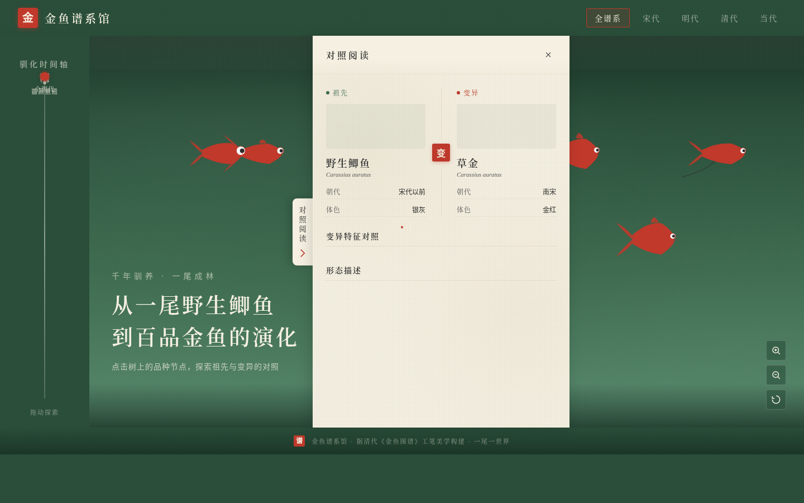

# 金鱼谱系馆 · Goldfish Lineage

**类别**：Web Mock　**日期**：2026-08-19

## 主题
一个数字化的「金鱼谱系馆」——以清代《金鱼图谱》工笔彩绘美学，把金鱼从野生鲫鱼到数百培育品种的演化史做成一棵可探索的谱系树。用户沿驯化时间轴下潜，在树上点击品种，打开祖先与变异特征的「对照阅读」面板。整站是一棵会生长的树，不是一摞卡片。

## 设计观点
近期 web 作品已用过横向长卷、地图伴飞、垂直剖面、时间游标、工程图纸、俯视工作台等空间模型；本版首次采用「演化谱系树 + 对照阅读」结构，题材（金鱼培育史）亦为全库首次出现。

## 预览

妙搭在线预览：https://dcniaqwtmoca.feishu.cn/page/QYIXmc4TNdOXUdaDZ0QcKZvente

## 核心交互
- 谱系树即导航：点品种节点聚焦该枝
- 对照阅读面板：祖先 vs 变异品种逐项对照
- 驯化时间轴联动高亮各朝代品种
- 自定义光标（开页居中，hover 变鱼眼）

## 文件说明
- `index.html` —— 入口
- `css/style.css` —— 样式与色彩/字体系统
- `js/cursor.js` —— 自定义光标
- `js/data.js` —— 11 个品种真实数据
- `js/tree.js` —— 谱系树渲染与导航
- `js/panel.js` —— 对照阅读面板
- `js/timeline.js` —— 驯化时间轴
- `js/main.js` —— 主入口与初始化
- `设计规范.md` —— 完整设计规范
- `preview.png` —— 桌面 1440×900 截图

## 技术栈
原生 HTML/CSS/JS，无框架。RAF 随可见性暂停，支持 prefers-reduced-motion，响应式 1440/1024/768/390。
