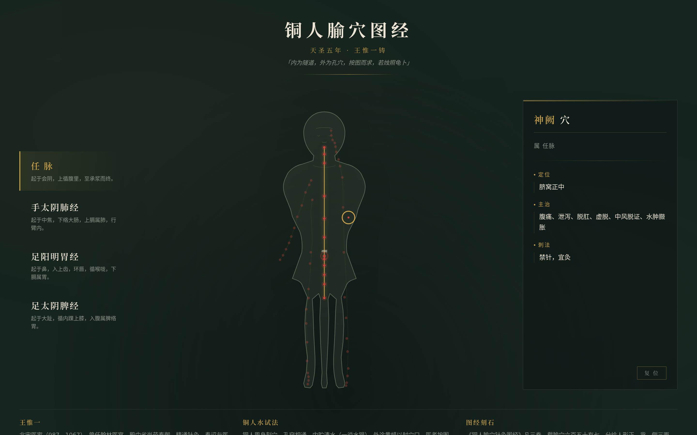

# 铜人腧穴图经 · V1 网页设计

## 主题

针灸铜人腧穴经络数字图经——以天圣铜人为空间模型，鎏金经脉沿正面静立铜人流注，朱砂腧穴可循经点亮并查阅。

## 简介

天圣五年（1027年），太医王惟一铸针灸铜人两具，著《铜人腧穴针灸图经》三卷，为中国医学史上第一部国家级经穴标准。本设计将铜人转化为可交互的数字图谱：点击经脉，鎏金线条沿人体流注描线；点击腧穴，朱砂点脉冲发光，右侧档案面板展开穴位的定位、主治与刺灸法。

收录任脉、肺经、胃经、脾经四条经脉共 55 个腧穴，数据均取自中医针灸学教材。

## 截图

## 妙搭预览

在线预览链接：https://dcniaqwtmoca.feishu.cn/page/IKcLmSmHFd9bRpaVdvrc8dhKn5b

## 文件说明

| 文件 | 说明 |
|------|------|
| `index.html` | 完整源码（纯 vanilla 单文件，1614 行，54KB） |
| `preview.png` | 1440×900 视口截图（2x 高清，展示任脉激活+神阙选中态） |
| `设计规范.md` | 配色系统、字体、布局、动效、交互逻辑完整规范 |

## 技术栈

- 纯 vanilla HTML/CSS/JS 单文件，无框架/无 CDN/无构建步骤
- SVG 矢量铜人（viewBox 0 0 400 800）+ polyline 经脉路径 + circle 穴位点
- CSS Grid 三栏布局 + CSS Custom Properties 主题
- requestAnimationFrame 自定义光标（RAF lerp + visibilitychange 生命周期管理）
- stroke-dashoffset 经脉描线流注动画
- prefers-reduced-motion 降级支持

## 配色

磁青（#16241F）底色 × 鎏金（#C9A24B）经脉 × 朱砂（#C8443B）腧穴——「铜—金—砂」三色物质层级，无蓝紫渐变。

## 交互

1. 点击左栏经脉卡片 → 鎏金经脉描线流注 → 腧穴逐一点亮
2. 点击铜人上的穴位点 → 朱砂脉冲 → 右侧档案面板展开
3. 点击面板内穴位标签 → 直接切换穴位档案
4. 自定义光标：开页居中显示，RAF 平滑跟随，悬停可交互元素时放大
