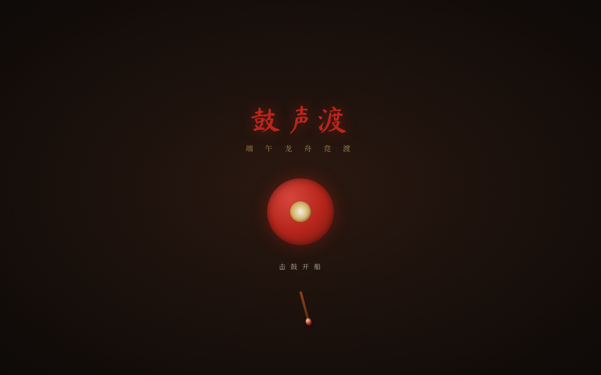

# 鼓声渡 · 龙舟竞渡

**类别**：Web Mock　**日期**：2026-08-19　**类型**：文化体验 / Editorial 展览型网站

## 主题
端午龙舟竞渡——以击鼓节奏驱动龙舟横向竞渡的方式，展开端午龙舟的真实文化内容。

## 简介
整站是一段横向江面竞渡。用户敲击页面上的朱漆大鼓打出节奏，鼓点驱动龙舟在横向长卷江面上前进；节奏越稳，桨越齐、船越快；节奏散乱则桨影参差、船身晃动。航程分五段里程，船到每个埠头停靠展开内容：起龙仪式、采青、龙舟结构图解（龙头/鼓手/舵手/桡手）、竞渡规则、各地舟俗（广东叠滘漂移、湖南汨罗、贵州苗族独木龙舟）、夺标与龙舟饭。

签名时刻：第一次把乱节奏打稳时，散乱桨影瞬间收成一条齐桨、船猛然提速。

## 妙搭预览
https://dcniaqwtmoca.feishu.cn/page/Pbcbmhj6rdaVSka0fc4csPjxnJh

## 文件说明
- `index.html` —— 单文件应用（含 HTML/CSS/JS）
- `设计规范.md` —— 色板、字体、动效系统、交互机制
- `preview.png` —— 桌面端 1440×900 截图

## 技术栈
- 单文件 HTML（自定义光标、Canvas/DOM 动效、击鼓节奏稳定度算法）
- 外部依赖：Google Fonts（Ma Shan Zheng、Noto Serif SC）
- 支持 prefers-reduced-motion；RAF 随可见性暂停；零未定义引用

## 设计要点
- 空间模型：横向江面长卷（非竖向 Section 堆叠）
- 主输入：击鼓（点击/空格），非拖拽/滚动
- 配色：江水墨绿 + 朱漆大鼓 + 桐油深木 + 米白浪花 + 鎏金，无蓝紫渐变
- 中文文案为主
