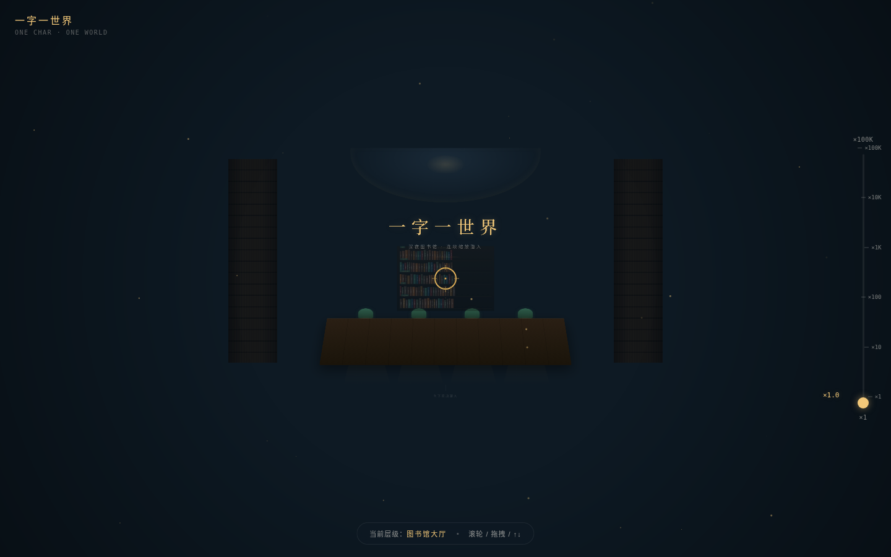
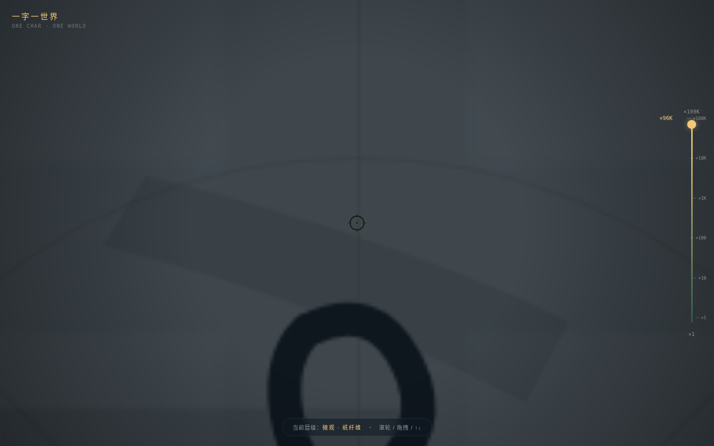

# 一字一世界 · 深夜图书馆连续缩放潜入

> Arc 每日设计 Mock · V1 网页设计 · 2026-08-20

## 主题

图书馆 · 书籍 · 汉字。整站是一次连续缩放潜入——从深夜图书馆大厅出发，经书架、书脊、摊开的书页、一行字、一个「書」字、一笔一画，最终潜到纸张纤维与墨色微观。滚轮即显微镜调焦。

## 简介

不是 Landing Page，不是卡片网格。空间模型为 `continuous_scale_zoom_dive`：8 个尺度层级在固定舞台中心叠放，层间用 scale + opacity 高斯插值连续过渡。用户通过滚轮 / 倍率尺 / 键盘 / 双指捏合四通道驱动同一 `logZoom` 状态（×1 → ×100K），尺度连续、由用户推动。每潜一层，世界换一种质感（建筑 → 木 → 纸 → 墨 → 纤维）。

签名记忆点：从一页古籍无缝潜入「書」字的一笔——墨色涨满视野化作新的夜空，纸纤维如星野浮现。

## 截图展示

**首屏 · 图书馆大厅（×1）**

**高潮 · 微观纸纤维（×100K）**

## 妙搭预览链接

https://dcniaqwtmoca.feishu.cn/page/CG4Lm1d6IdXEsWajsQMcpWY8nuc

## 文件说明

| 文件 | 说明 |
|---|---|
| `index.html` | 纯 vanilla 单文件源码（57KB，含全部 8 层 + 交互 + 动效） |
| `设计规范.md` | 色彩 / 字体 / 空间模型 / 交互 / 动效系统规范 |
| `preview.png` | 首屏截图（1440×900，图书馆大厅） |
| `preview-micro.png` | 高潮截图（1440×900，微观纸纤维） |

## 技术栈

- 纯 HTML + CSS + 原生 JS，零框架、零 CDN、零外部图片 / 字体
- 系统字体栈：宋体（Noto Serif SC / Songti SC）、楷体（STKaiti）、无衬线（PingFang SC）、等宽（SF Mono）
- Canvas 2D 绘制纸纤维星野
- SVG path `stroke-dashoffset` 实现永字八法描红
- RAF 主循环 + 阻尼插值；`visibilitychange` 暂停 / 恢复
- `prefers-reduced-motion` 降级

## 设计自查

- [x] Browser QA：四尺寸零 Console Error、零资源 404、无横向溢出、截图非空白（std > 5）
- [x] 交互 QA：滚轮 / 倍率尺 / 键盘 1-8 跳层 / End 到底 均实际验证，8 层全部可达
- [x] 修复记录：初版 zoomMax=×10K 导致笔画层(×18K)与微观层(×100K)目标超出上限、签名高潮不可达；已提升 zoomMax 至 ×100K 并补全倍率尺刻度，微观层 opacity 0.96、标题可见
- [x] 删动画成立：8 层静态构图各自成立，景深 + 倍率尺足以建立层级
- [x] 灰度层级成立：不依赖颜色区分层级
- [x] 轮廓不与近期重复：continuous_scale_zoom_dive 在 43 条 web 指纹中零出现
- [x] 内容真实：中图法 I/K/G 分类、《说文解字》原文与字源、永字八法笔画名，无 Lorem Ipsum
- [x] 配色非蓝紫、非米色宣纸+朱砂高频组合

## 等待协调者检查后提交 GitHub

本任务仅完成到本地交付 + 妙搭预览，**未执行 git add/commit/push**。GitHub 提交由协调者（心跳检查）在质检通过后统一完成。
