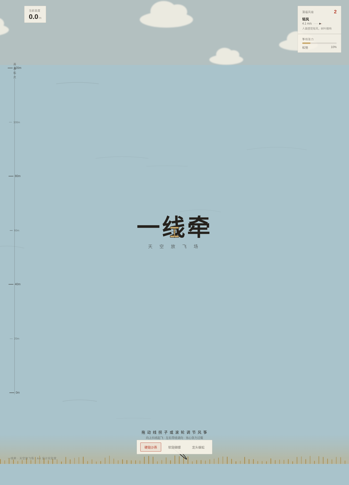

# 一线牵 · 天空放飞场

> Art 设计实验室 · 2026-08-20 V1 网页设计
> 主题：传统风筝（纸鸢）

## 简介
整站是一片竖向天空放飞场——地面在下、云层在上，0–120m 高度标尺是唯一空间主轴。你执线拐子收放筝线，靠线的张力与阵风把纸鸢送上天。三种真实风筝（硬翅沙燕 / 软翅蝴蝶 / 串式龙头蜈蚣）各有真实适飞风域与操控手感；阵风来时松垮的筝线瞬间绷直，风筝昂首跃升；张力过载会断线飘走。

题材「风筝」为 Art 实验室全库首次出现；「收放线（reel）+ 线张力物理」交互动词全库首次；竖向天空上升轴与近期下潜系方向相反、物理语义全新。

## 操作
- **滚轮向下 / 拖线拐子**：放线（线变长，风筝升高）
- **滚轮向上**：收线
- **左右移动鼠标**：带线调方向
- **切换风筝**：点击底部「硬翅沙燕 / 软翅蝴蝶 / 龙头蜈蚣」
- **断线**：张力过载自动断线，点「重试」复位

## 妙搭预览
https://dcniaqwtmoca.feishu.cn/page/ZeYumpb01dYXDjahuyHcSSzrn0c

> 注：妙搭应用分享权限需在飞书客户端手动设为「互联网获得链接的人可阅读」方可免登录访问；API/CLI 暂不支持修改妙搭应用分享权限。

## 文件说明
- `index.html` — 纯 vanilla 单文件源码（无 React/Babel/CDN/外部字体）
- `设计规范.md` — 配色/字体/空间/动效/物理系统完整规范
- `preview.png` — 1440px 首屏截图
- `preview/flying.png` — 放线升空后截图

## 技术栈
纯 HTML + CSS + 原生 JS，单文件。筝线用 SVG 贝塞尔曲线实时绘制悬链/绷直形态；风筝为手绘 SVG；RAF 随页面可见性暂停、卸载取消；支持 `prefers-reduced-motion` 降级；1440/1024/768/390 四档响应式零横向溢出。

## 配色
平涂晨空天青 `#A9C3CB` + 云白纸米 `#F5F1E6` + 燕羽墨黑 `#26221D` + 朱砂红 `#B43A28`（彩绘/张力警示）+ 麦秆黄 `#C9A86A`（线拐子/地面）。天空单色平涂，禁蓝紫渐变。

---
Art 设计实验室 · Orchestrator 流水线产出（Art Director → Designer → Browser QA → Critic → Repair → Quality Gate → Memory Writer）
