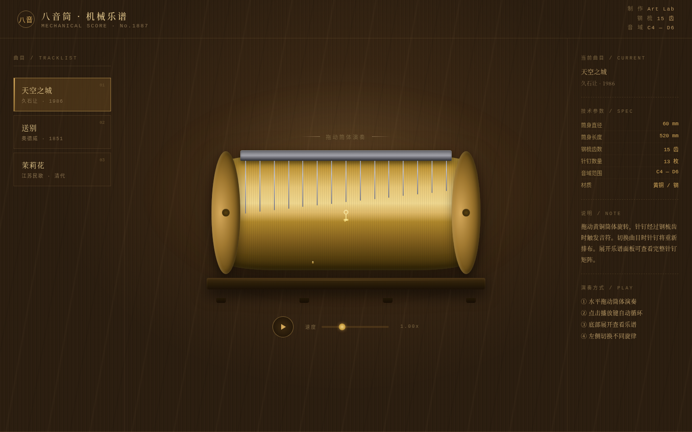

# 八音筒 · 机械乐谱

> 一只可拖拽旋转的黄铜八音筒。拖动即演奏，针钉触钢梳发声。



## 主题

以十九世纪机械八音盒为原型的交互式网页。整站不是信息展示页，而是一台可被演奏的虚拟乐器 — 黄铜筒体、钢梳、针钉矩阵，拖动旋转即奏响旋律。

## 简介

- **核心交互**：水平拖动黄铜筒体旋转，针钉经过钢梳齿时触发音符（Web Audio 实时合成）
- **物理惯性**：释放后筒体因惯性继续滑行，模拟真实八音盒的机械感
- **四首旋律**：天空之城、送别、茉莉花、欢乐颂 — 切换时针钉重排动画
- **展开乐谱**：底部面板可展开为 2D 针钉矩阵（时间轴 × 音高），与筒体同步
- **自动演奏**：播放键自动循环，速度滑块 0.2x–3x 可调
- **视觉反馈**：针钉接近发光、钢梳齿振动、音符涟漪扩散、暖光呼吸

## 妙搭预览链接

> 在线预览：https://dcniaqwtmoca.feishu.cn/page/IYgwm7RUUdPQO5ah6NZcMD1SnLc
>
> 本地版本：直接用浏览器打开 `index.html` 即可体验（纯静态单文件，无外部依赖）

## 文件说明

```
2026-08-20_八音筒机械乐谱_music-box-cylinder/
├── index.html          # 主文件（HTML + CSS + JS 单文件）
├── 设计规范.md          # 色板 / 字体 / 动效 / 空间结构完整规范
├── preview.png         # 1440px 宽截图预览
└── README.md           # 本文件
```

## 技术栈

- **纯 Vanilla JS**：无任何框架、无外部 CDN 依赖、单文件即可运行
- **Web Audio API**：`OscillatorNode` + `GainNode` + `BiquadFilter` 合成音乐盒音色（三角波 + ADSR 包络 + 低通滤波）
- **CSS 3D / 渐变**：纯 CSS 渲染黄铜筒体、钢梳、针钉、木基座
- **requestAnimationFrame**：物理惯性旋转 + 针钉曲面投影 + 光标缓动跟随
- **CSS Animation**：梳齿振动、音符涟漪、暖光呼吸、入场动效等 14 项组件级动效
- **prefers-reduced-motion**：完整减动效降级支持

## 操作方式

1. 水平拖动中央黄铜筒体 → 演奏旋律
2. 点击左侧曲目 → 切换不同旋律（针钉重排）
3. 点击 ▶ 播放按钮 → 自动循环演奏
4. 拖动速度滑块 → 调节自动播放速率
5. 点击底部「展开乐谱」→ 查看针钉矩阵

## 设计规范摘要

- **配色**：黄铜 `#c49a3c` + 核桃木 `#1a120a` + 钢灰 `#a0a0a8` + 暖琥珀 `#ffb45a`
- **字体**：宋体衬线（人文气质）+ 等宽字体（技术参数）
- **动效**：14 项组件级特效，全部符合机械物理逻辑
- **空间模型**：固定舞台式，以筒体为中心，非滚动 Landing Page
