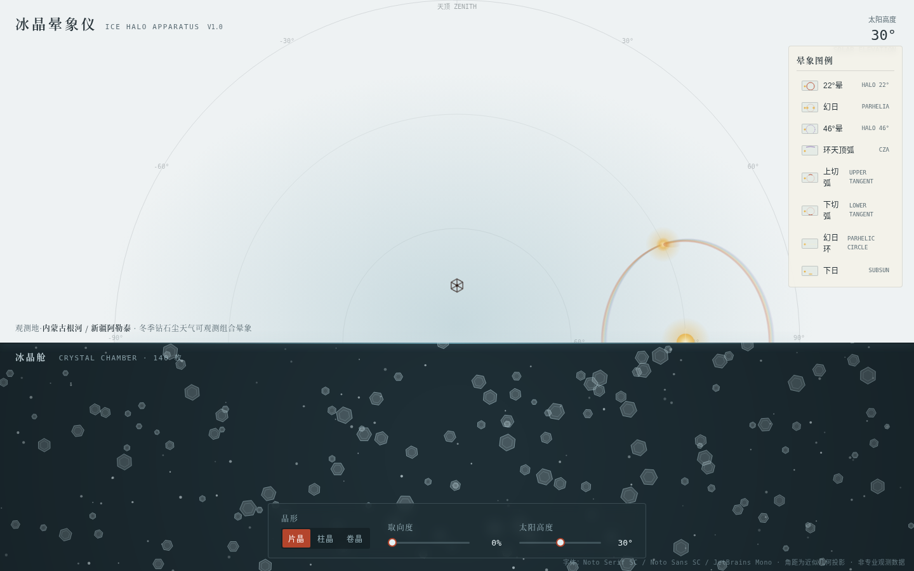

# 冰晶晕象仪 · Ice Halo Apparatus

**主题**：大气光学 · 日晕生成仪器（V1 网页设计）

## 简介

一台可以亲手拨动的「日晕生成仪」。高纬冬季天空中的 22°晕、幻日、环天顶弧，本质上都是六棱冰晶在云中的取向分布决定的——所以本站把天空和冰晶放进同一台仪器：上半部是天穹穹顶投影，下半部是悬浮着数百枚冰晶的微舱。拨动取向拨杆，满舱纷乱自转的冰晶逐一对齐，天穹上弥散的晕环随之碎裂、收拢成两个明亮的幻日。交互即成因。

- 晶形切换：片晶 / 柱晶 / 卷晶
- 取向拨杆：纷乱 ↔ 定向连续过渡
- 太阳高度滑杆：0°–60°，晕象位置实时联动（环天顶弧仅在太阳低于 32° 时出现）
- 8 种真实晕象档案：点击图例 → 天穹高亮 + 单晶光路折射特写 + 中文成因注释

## 截图

## 妙搭在线预览

https://dcniaqwtmoca.feishu.cn/page/FYMCmuNgSd4kjraaCDLcjSGonq5

## 文件说明

- `index.html` — 完整单文件实现（纯 vanilla，无框架无构建依赖，浏览器直接打开即可运行）
- `设计规范.md` — 从源码提取的色值、字体、状态机、动效系统
- `preview.png` — 1440×900 默认状态截图（无头 Chromium 实际渲染）
- `thumbnail.png` — 妙搭应用缩略图

## 技术栈

纯 HTML / CSS / JavaScript 单文件；Canvas 双画布（天穹 + 冰晶舱）；零外部依赖。RAF 随页面可见性暂停、卸载取消；支持 `prefers-reduced-motion` 降级；1440 / 1024 / 768 / 390 四档响应式实测通过。
