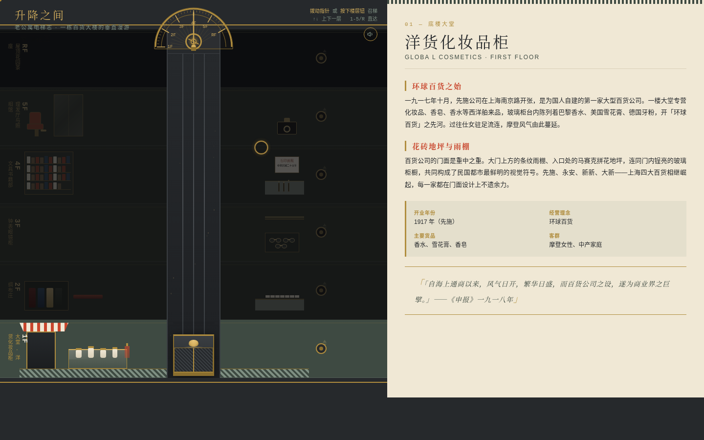
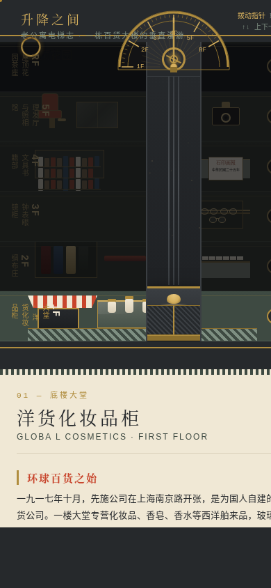

# 升降之间 · 老公寓电梯志

> Art 每日设计 Mock · V1 网页设计 · 2026-08-20

## 主题

民国 Art Deco 百货大楼。整站是一栋六层百货大楼的纵剖面，老式指针电梯是全站唯一导航——拨动半月形黄铜表盘指针或按下楼层召唤钮召梯，轿厢带惯性升降、到站铃响、铁栅拉门开启，逐层揭示大堂洋货、绸布庄、钟表眼镜、文具书籍、理发照相、屋顶花园六个真实业态场景与历史档案。

## 简介

- 空间模型：建筑纵剖 + 电梯井道移动取景框（全库首次）
- 主交互：拖拽半月表盘指针召梯（阻尼+吸附）/ 楼层召唤钮 / 键盘直达
- 签名时刻：到站——指针扫过表盘刻度、铃响、铁栅拉门横向拉开、楼层灯光自暗渐亮
- 配色：水磨石灰绿 + 奶油 + 电梯铁灰黑 + 黄铜 + 暖灯黄，霓虹朱红仅作点缀（无蓝紫渐变、无纸墨朱砂）
- 内容：先施(1917)/永安(1918)/新新(1926)/大新(1936) 四大百货真实史料

## 截图

桌面端（1440px）：

移动端（390px）：

## 在线预览

妙搭应用：https://dcniaqwtmoca.feishu.cn/page/RPPzml68HdxvHAaoyi1cvpcUnve

## 文件说明

- `index.html` — 全部源码（纯 vanilla HTML/CSS/JS 单文件，零外部依赖）
- `设计规范.md` — 设计母题、色彩/字体/空间/交互/动效系统（色值提取自源码 CSS 变量）
- `preview.png` / `preview-mobile.png` — chromium headless 实际渲染截图

## 技术栈

纯 vanilla 单文件；CSS 变量主题；JS 状态机管理电梯运行（busy 防叠加）；RAF 驱动机械动效；WebAudio 到站铃（默认静音）；`prefers-reduced-motion` 完整降级；响应式断点 1024/768/390。

## 本地运行

直接用浏览器打开 `index.html` 即可，无需构建与网络。
