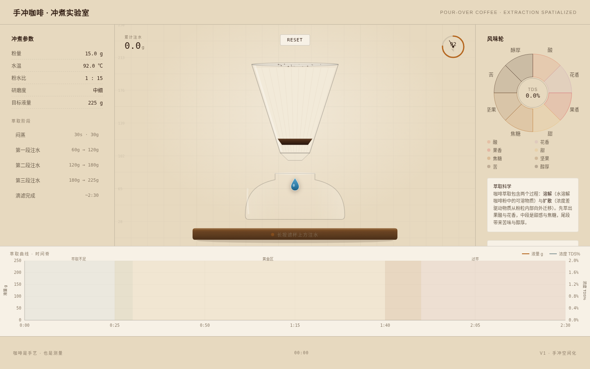

# 手冲咖啡冲煮 · 注水萃取曲线

> 咖啡是手艺 · 也是测量

一个真实可交互的手冲咖啡冲煮过程可视化网页。整站是一台可亲手注水的手冲仪表：玻璃滤杯为固定视觉中心，注水萃取曲线为横向时间脊，分次脉冲注水驱动闷蒸、滴落、浓度曲线与风味轮联动。温热厨房静物质感与精密色谱测量层并置。

## 预览

妙搭在线预览：https://dcniaqwtmoca.feishu.cn/page/LklqmAh8odeXTDa19Hbc6ifRnQg

## 主题与简介
- 主题：手冲咖啡冲煮过程空间化
- 设计观点："咖啡是手艺也是测量"——有机静物 × 实验室测量双线视觉语言
- 空间模型：固定视口仪表盘（三列：冲煮参数 / 冲煮舞台 / 风味轮 + 萃取科学），底部萃取曲线横向时间脊
- 签名瞬间：闷蒸——首次注水后咖啡粉层膨胀隆起、表面冒出细密 CO₂ 气泡、缓缓塌陷

## 核心交互
- **长按滤杯上方注水**：唯一输入，分次脉冲注水（含首次闷蒸）
- **闷蒸膨胀排气**：真实物理表现
- **萃取曲线实时绘制**：液量（琥珀实线）+ TDS 浓度（青灰虚线）双轴，三萃取区段语义底色
- **曲线游标回看**：沿曲线拖动游标，回看任意时刻的液量 / 浓度 / 风味状态
- **风味轮联动**：8 维风味（酸 / 花香 / 果香 / 甜 / 焦糖 / 坚果 / 苦 / 醇厚）随萃取区段显色
- **RESET**：重置整杯冲煮

## 真实内容
粉量 15g · 水温 92℃ · 粉水比 1:15 · 研磨度中细 · 目标液量 225g；闷蒸 30s·30g；三段注水 60→120→180→225g；滴滤完成约 2:30。萃取科学（溶解与扩散）、注水手法（中心 / 画圈）、萃取三区段（不足 / 黄金 / 过萃）。

## 文件说明
- `index.html` — 纯 vanilla 单文件源码（canvas + SVG，无 React/Babel/JS CDN）
- `preview.png` — 1440×900 初始态截图
- `设计规范.md` — 配色 / 字体 / 材质 / 动效系统 / 交互详细规范
- `README.md` — 本文件

## 技术栈
- 纯 vanilla 单文件 HTML，canvas + SVG 混合渲染
- CSS 变量主题化（暖棕色谱，禁蓝紫渐变）
- 响应式 1440 / 1024 / 768 / 390
- 自定义水滴光标（开页居中，高对比，层级最高）
- RAF 随 visibilitychange 暂停且 beforeunload 取消；prefers-reduced-motion 降级；快速操作不叠加定时器；高频鼠标事件直接操作 DOM
- 外部依赖（诚实声明）：Noto Serif SC / JetBrains Mono 字体经 miaoda.feishucdn.com CDN 加载，离线回退系统字体不影响功能

## 自查结论
- [x] Browser QA PASS：无白屏、无 JS 错误、无横向溢出（1440/1024/768/390）
- [x] 交互端到端验证：注水 → 液量 0→176g、闷蒸排气可见、曲线绘制、风味轮响应、计时推进
- [x] 自定义光标开页居中（720,450 = 1440×900 中心）
- [x] 截图非空白（像素 std 43.66）
- [x] Contract Fidelity FULL，CRITICAL=0，Quality Gate PASS
- [x] 元数据已清理（.git / .spark / package*.json 移除）

等待协调者检查后提交 GitHub。
