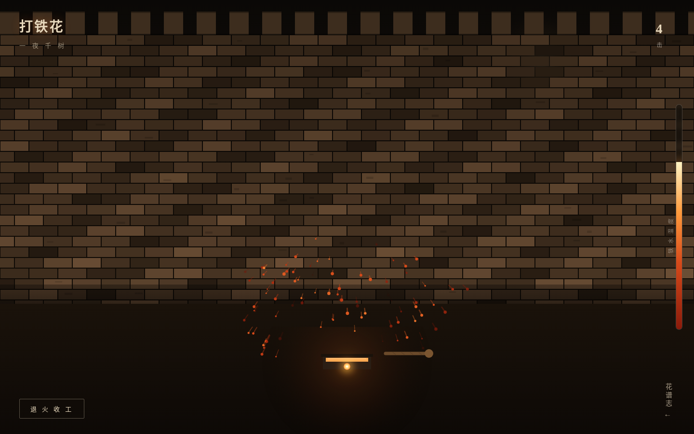

# 打铁花 · 城墙花谱

> V1 网页设计 · 2026-08-20 · Art 设计实验室

**妙搭预览**：https://dcniaqwtmoca.feishu.cn/page/A0pGmIOWKdQe3oau0jDcDQ0Mnjc

## 简介

一个真实可交互的打铁花仪式网页。用户扮演打铁花艺人，在古城墙前击打铁水——按住蓄力，松开挥板，铁水白炽飞溅、撞墙迸裂、溅落冷却，每一次击打都在墙面留下不可逆灼痕。多次击打累积，墙面逐渐烧成一幅只属于自己的「火花壁画」。打完「退火收工」，场灯渐暗，灼痕整体显影，生成带编号与朱红落款印的今夜花谱。

题材：确山打铁花，国家级非物质文化遗产。不是观赏页，是一场可以亲手完成的仪式。

## 操作

- **按住蓄力**：花棒后拉、铁水槽升温、温度标尺上升、光标灼热脉动。
- **松开击打**：铁水飞溅撞墙，火花按物理弹道迸裂并冷却。
- **连续击打**：墙面灼痕不可逆累积成画。
- **退火收工**：暗场显影，生成今夜花谱（编号 = 日期·击打数 + 朱红印），「再打一场」重置。
- **花谱志**（下滚）：花棚与仪式 / 花棒解剖（可展开剖面）/ 温度色阶（拖动标尺看五档铁色）/ 艺人规矩 / 传承。

## 文件说明

| 文件 | 说明 |
|------|------|
| `index.html` | 单文件源码（HTML+CSS+JS，Canvas 绘制），47.8 KB |
| `preview.png` | 首屏击打中截图 |
| `设计规范.md` | 色彩 / 字体 / 动效 / 交互 / 健壮性规范 |
| `README.md` | 本文件 |

## 技术栈

- 纯 vanilla 单文件，无 React / Babel / CDN / 外部图片 / 外部字体。
- 4 个 Canvas 分层：城墙（wallCanvas）/ 灼痕（burnCanvas）/ 火花（sparkCanvas）/ 花棒（stickCanvas）。
- 火花物理：初速 + 重力 + 空气阻力 + 撞墙反射 + 温度冷却色阶。
- 自定义光标：开页居中、z-9999、白炽高对比、蓄力脉动。
- 健壮性：RAF 随可见性暂停、卸载清理、`prefers-reduced-motion` 降级、触摸兼容、响应式无溢出。

## 设计观点

空间模型「wall_face_canvas_stage」（墙面画布舞台）在历史作品中无先例。核心机制——击打即作画、墙面是不可逆画布——与打铁花撞墙溅射的真实场景天然同构。一切动效来自热与力，禁与热无关的装饰特效。配色为铁温度色阶（白炽→金橙→橙红→赤红→暗红），禁蓝紫渐变，与近期作品不雷同。

## 内容真实性

确山打铁花真实知识：河南确山民间焰火技艺，2008 年入选国家级非遗扩展名录，北宋已有记载；生铁熔点约 1538°C，铁水约 1600°C；花棚柳木三层棚架；花棒新鲜柳木浸水制成，分舀棒/打棒；艺人规矩赤膊上阵、击打准而脆、逆风不打。无 Lorem Ipsum。

---

等待协调者检查后提交 GitHub。
