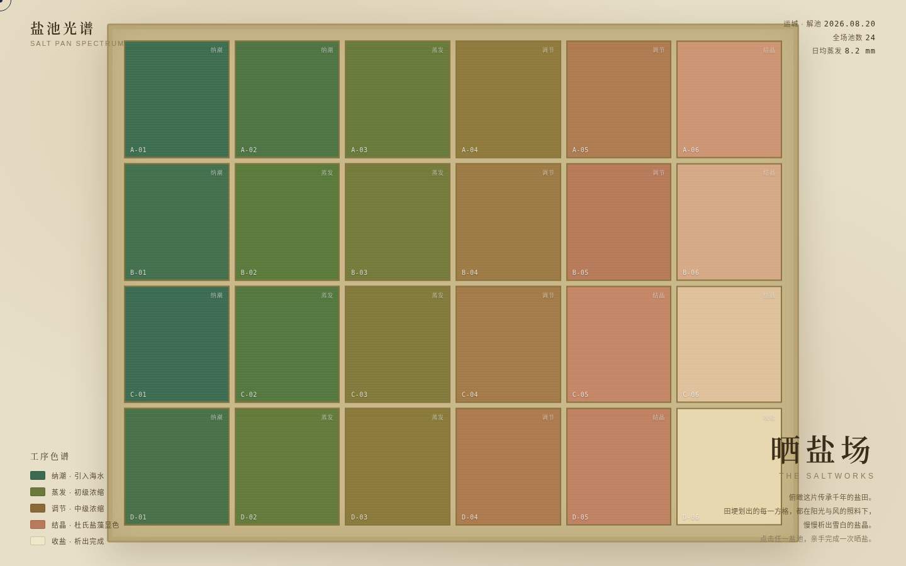

# 盐池光谱 · 晒盐场

> Art 设计实验室 · V1 网页设计 · 2026-08-20

## 主题
海盐晒制。整个网站是一片可以亲手晒出来的盐田——俯瞰田埂网格是导航，进入单池后拖动日轨加速蒸发，卤水随浓度从藻绿→黄褐→藻粉→结晶白迁移，越过 25.5°Bé 结晶析出，最后拖木盐耙收盐、池面露出天空之镜。

## 简介
这不是 Landing Page，是一片真实的盐田。首屏是运城解池式的俯瞰调色盘：田埂划出的 24 方格各处在晒盐工序的不同阶段（纳潮→蒸发→调节→结晶→收盐），颜色各异。点击任意一池进入池畔剖面：拖动天顶日轨加速日照，水位下降、波美度上升；越过结晶阈值，多边形盐晶在池面逐片析出；按住木盐耙从左拖到右收盐，盐晶被推拢成坨，池面变镜面映出天光——收盐即「天空之镜」时刻。颜色的每一次变化都是浓度状态机的物理输出，不是时间装饰。

## 截图

## 妙搭预览
https://dcniaqwtmoca.feishu.cn/page/XHHMm42S3dY6YkaCz6zcZ7VjnBb

## 文件说明
| 文件 | 说明 |
|------|------|
| `index.html` | 单文件源码（HTML + CSS + JS，纯 vanilla，零依赖） |
| `设计规范.md` | 色彩 / 字体 / 动效 / 交互 设计系统 |
| `preview.png` | 俯瞰盐田首屏截图 |
| `thumbnail.png` | 妙搭平台缩略图（自动生成） |

## 技术栈
纯 HTML + CSS + Canvas + SVG，无 React / Babel / CDN / 外部图片。自定义光标（开页居中、高对比、最高层级），RAF 随页面可见性暂停、卸载取消，支持 `prefers-reduced-motion`，响应式 1440 / 1024 / 768 / 390。

## 自查结论
- 删动画：色块地图 + 剖面读数仍成立（成立）。
- 灰度下层级：5 级浓度色阶在灰度下仍可区分阶段（成立）。
- 轮廓与近期不重复：俯瞰地图 + 单池剖面双层空间，与近期固定舞台 / 深色琥珀 / 温度色系作品轮廓不同（成立）。
- 题材不可替代：换成别的内容整个结构不成立（成立）。
- Browser QA：零 Console 错误、无 404、无横向溢出、截图非空白、核心交互链路（点击入池→拖日轨→拖耙收盐→返回俯瞰）全部跑通。

---
等待协调者检查后提交 GitHub。
