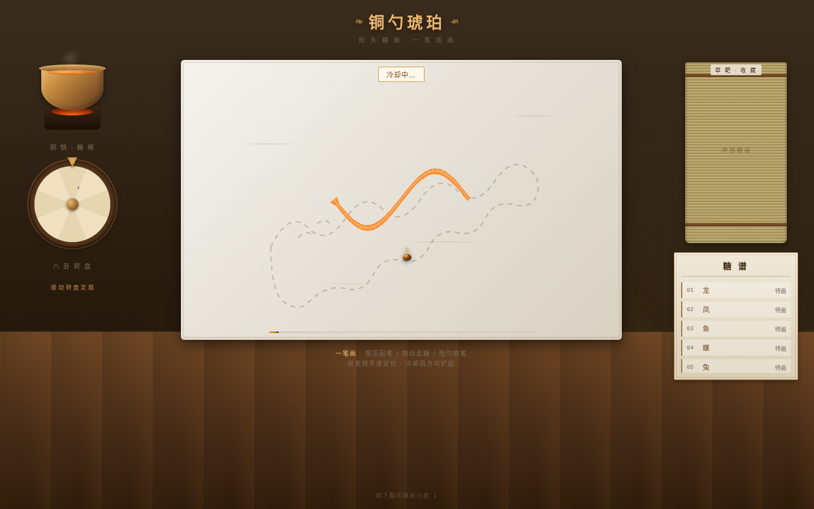
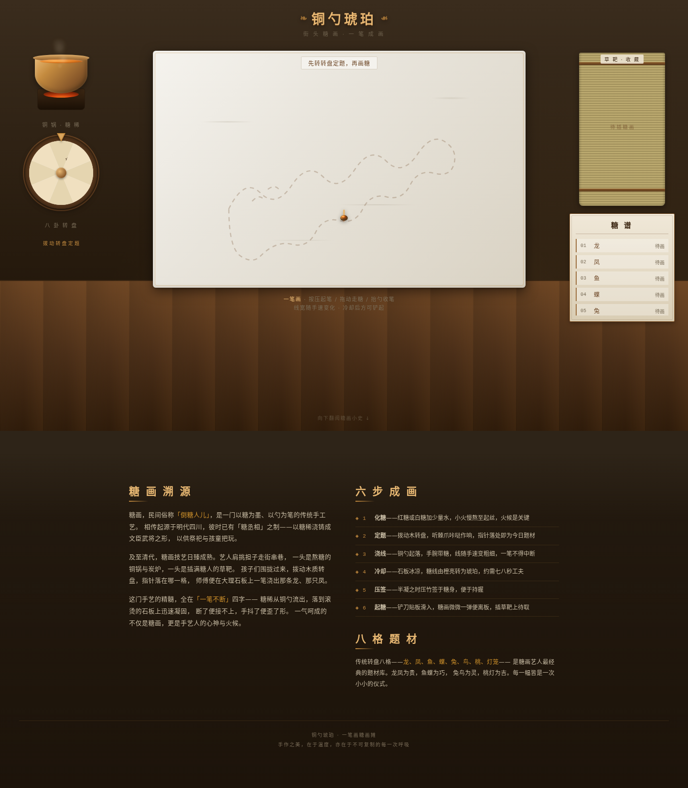

# 铜勺琥珀 · 糖画摊一笔画

> Art 每日设计 Mock · V1 网页设计 · 2026-08-20
> 题材：民间街头手艺——糖画

## 简介

整站就是一张街头糖画摊。中央一块大理石板为案，左上角铜锅坐在炭炉上化着糖稀，左侧立一只八卦木转盘（八格经典题材：龙 / 凤 / 鱼 / 蝶 / 兔 / 鸟 / 桃 / 灯笼），右侧是「糖谱」档案与「草靶」收藏。用户先转轮定题，再执铜勺在大理石板上**徒手一笔浇糖**——按压起笔、拖动走糖、抬勺收笔，糖线当面从炽亮液态冷却成半透明琥珀；随后压竹签、用铲刀「起糖」，作品插上草靶收藏。一笔画是糖画这门手艺的本体，也是本站唯一核心交互。

向下翻阅可见「糖画溯源」「六步成画」「八格题材」三段编辑式科普，内容均紧扣糖画本身（明代「糖丞相」、清代走街串巷、化糖 / 定题 / 浇线 / 冷却 / 压签 / 起糖六步、龙凤贵 / 鱼蝶巧 / 兔鸟灵 / 桃灯吉）。

## 截图预览

## 妙搭在线预览

https://dcniaqwtmoca.feishu.cn/page/A3Fjmg7NOd6QHJaC8hsckD9nn2d

## 文件说明

| 文件 | 说明 |
|---|---|
| `index.html` | 纯 vanilla 单文件源码（无 React / Babel / CDN / 外部图片 / 外部字体） |
| `设计规范.md` | 从源码实测提取的色值、字体、动效系统与核心交互闭环 |
| `preview/preview.png` | 摊位首屏截图（1440×900） |
| `preview/draw_test.png` | 徒手绘糖实测截图（糖线已渲染、冷却状态已触发） |
| `preview/fullpage.png` | 整页截图（含糖画小史编辑区） |
| `preview/thumbnail.png` | 妙搭平台缩略图 |

## 技术栈

- 纯 HTML / CSS / Canvas / 原生 JS，单文件零外部依赖
- 糖线渲染：Canvas（`drawSugarSegment` / `drawSugarDrop` / `drawTailOff`，线宽随手速）
- 引导稿：内联 SVG path（`setGuidePath`）
- 自定义光标：铜勺缓动跟随，开页居中、高对比、层级最高
- 健壮性：RAF / 蒸汽粒子随可见性暂停且卸载取消、快速操作不叠加定时器、`prefers-reduced-motion` 降级、零未定义引用
- 适配 1440 / 1024 / 768 / 390

## 自查结论

- Browser QA：四尺寸零 Console Error、零 404、零横向溢出；截图像素 std 76–87（非空白）。
- 核心交互实测：徒手绘糖后画布出现 178 个琥珀糖线像素，冷却状态当场触发，起糖 / 收藏 DOM 元素齐备。
- Design Contract 全部 Must Keep 落地（大理石中心 / 冷却可见 / 起糖离板 / 转盘定题 / 材质贯穿），未退化为 Landing Page 或贴纸工具。
- 内容不可替换性：糖画题材抽出后页面（转盘 / 化糖 / 浇线 / 冷却 / 起糖 / 草靶 / 六步 / 八格）整体坍塌，题材性成立。

> 等待协调者检查后提交 GitHub（本任务禁止 git add / commit / push）。
