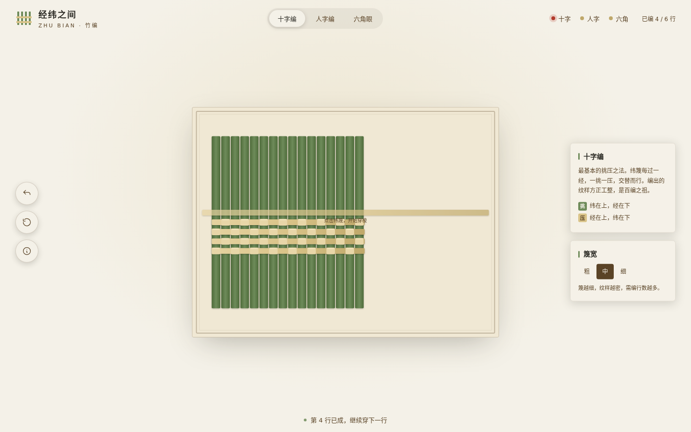
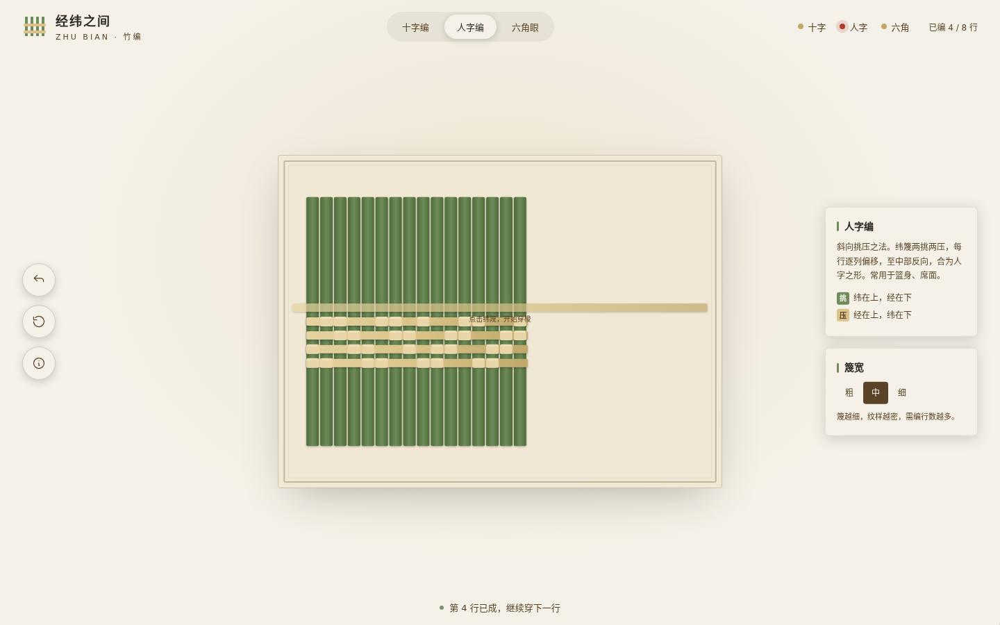
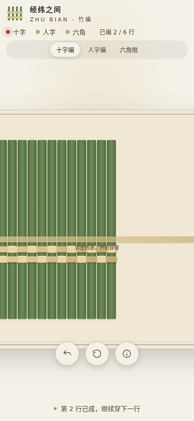

# 经纬之间·活的编织面

> V1 网页设计 ｜ 2026-08-20 ｜ 主题：传统竹编（篾匠工艺）



## 简介

整站是一张**活着的竹编编织面**。俯视视角下，经篾竖排、纬篾横排；点击下方纬篾，它在经篾之间逐行穿梭挑压，编织面一行行生长出来。

挑压规则即内容——**十字编、人字编、六角眼**三种真实纹样各自对应一套可验证的挑压数术；每完成一种纹样，即解锁该编法所成的真实竹编器物档案（瓷胎竹编茶具、嵊州竹编动物、东阳六角眼提篮）。三编全部完成后，平面编织面锁边收口、缓缓 3D 卷立，演示器物成形，钤一枚朱砂「成器」印。

题材不可替换：把竹编换成别的内容，挑压数术与器物档案整盘失效。

## 妙搭预览

🔗 https://dcniaqwtmoca.feishu.cn/page/Ev0AmfogvdVeAJaJY8CcxZ1Vn4c

## 截图

| 主界面（十字编 4/6 行） | 人字编纹样 | 移动端 390px |
|---|---|---|
|  |  |  |

## 核心交互

- 选纹样（十字/人字/六角眼）与篾宽档（粗/中/细，细档纹样更密、需编行数更多）
- 点击下方待穿纬篾 → 纬篾穿梭于经篾之间，按纹样挑压规则逐列判「挑起/压下」，篾条弯曲让位
- 行尾落定成行，编织面向上生长，「已编 N / M 行」实时更新
- 编错可「抽回末行」；「重新起头」重置
- 完成纹样 → 弹出对应器物档案卡
- 三编全成 → 锁边 → 3D 卷立成器 → 朱砂「成器」印

## 文件说明

```
2026-08-20_经纬之间_bamboo-weaving/
├── index.html          单文件源码（纯 vanilla，内联 CSS + JS + SVG）
├── 设计规范.md         色值/字体/动效/纹样规则/器物档案/自检结论
├── README.md           本文件
├── preview.png         主界面截图（1440px，十字编进行中）
└── preview/
    ├── renzi_pattern.png   人字编纹样截图
    └── mobile_390.png      移动端 390px 截图
```

## 技术栈

- **纯 vanilla 单文件 HTML**：内联 CSS + JavaScript + SVG，无 React / Babel / CDN / 外部字体 / 外部图片，零网络请求，从根本上规避白屏。
- 编织面用 SVG 精确绘制篾条（可表达挑压上下层与弯曲弧度）；成形用 CSS 3D `perspective` + `rotateX/rotateY`。
- 自定义篾丝细签光标（`requestAnimationFrame` 跟随，随 `visibilitychange` 暂停、卸载取消）。
- 支持 `prefers-reduced-motion` 动画降级。
- 响应式：1440 / 1024 / 768 / 390 四档无横向溢出。

**外部依赖**：无。

## 设计来源

俯视一位老篾匠案前的编织面——竹青篾黄、桐油案台、瓷白底、墨线勾边。设计语言来自真实的竹编工艺本身，而非后期贴皮。

---

等待协调者检查后提交 GitHub。
