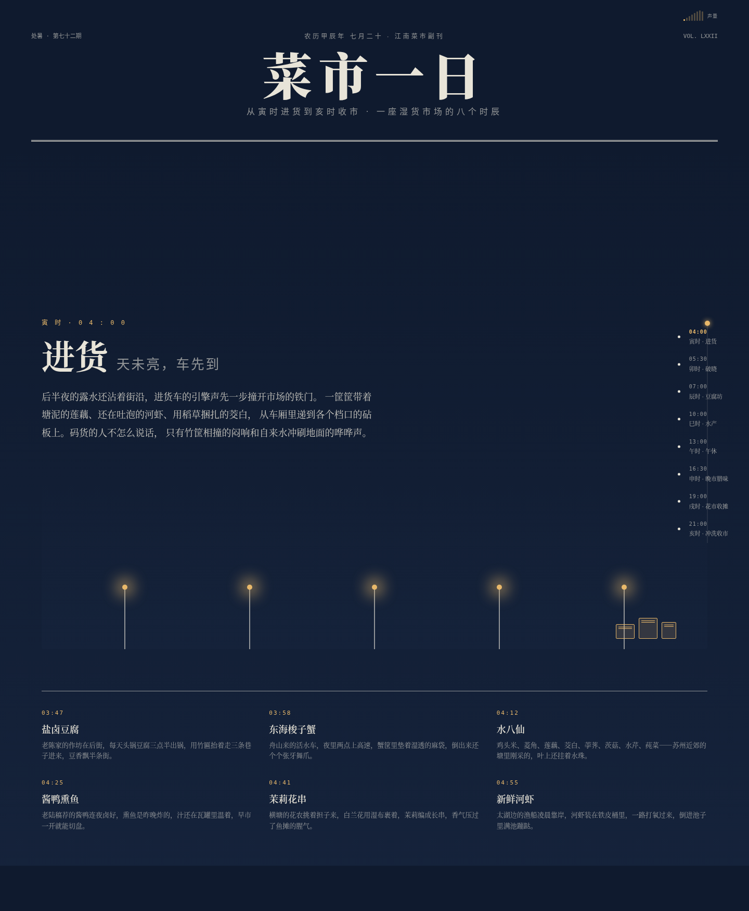

# 菜市一日 · 江南湿货市场时辰志

## 主题

一座江南湿货菜市从寅时进货到亥时收市的完整一天，以报纸副刊式编辑长卷呈现。垂直滚动 = 推进市场时钟，全局色温、声量、摊位状态随时刻连续变化。

## 简介

这不是 Landing Page，是一份可以滚动读完的「市集报纸副刊」。用户像在清晨走进一座真实菜市：先听见进货车的动静，看见灯一排排亮起，逛过豆腐坊与水产摊，在午后安静处放慢，晚市被人流推着走，最后看水枪冲洗地面、市场合拢。

8 个时辰锚点段落贯穿全天：

- **寅时 04:00 进货** — 后半夜的进货车、街灯、竹筐碰撞声
- **卯时 05:30 破晓** — 顶灯逐排点亮，色温由冷转暖（签名时刻）
- **辰时 07:00 豆腐坊** — 盐卤老豆腐热气升腾，粉笔价目黑板
- **巳时 10:00 水产** — 梭子蟹/黄鱼/河虾，水面波纹鱼影
- **午时 13:00 午休** — 吊扇慢转，摊主打盹，鸡头米时令（留白段落）
- **申时 16:30 晚市腊味** — 酱鸭熏鱼挂满铁钩，下班人潮涌动
- **戌时 19:00 花市收摊** — 茉莉白兰花瓣飘落，最后一把便宜卖
- **亥时 21:00 冲洗收市** — 高压水枪冲过湿地面，卷帘门合拢，明日预告

## 截图

## 妙搭预览

https://dcniaqwtmoca.feishu.cn/page/JSUymKub5dwCcGab1zjcuiB0nYf

## 文件说明

| 文件 | 说明 |
|------|------|
| `index.html` | 完整源码（纯 vanilla 单文件，73.4KB） |
| `preview.png` | 桌面端首屏截图（1440×1750） |
| `设计规范.md` | 色值、字体、动效系统、布局规范 |

## 技术栈

- 纯 vanilla HTML + CSS + JavaScript（单文件，零外部依赖）
- 所有视觉用 CSS/SVG 手绘（进货车/豆腐热气/水面波纹/吊扇/腊味铁钩/花篮/水枪冲洗）
- 9 个色温关键帧驱动全局色彩连续插值
- 18 个组件级特效，全部与「市集一天」语义绑定
- 自定义粉笔光标（圆点+圆环，mix-blend-mode: difference）
- `prefers-reduced-motion` 全量降级，`visibilitychange` 暂停 rAF

## 设计日期

2026-08-20（周四）· 处暑前一日
