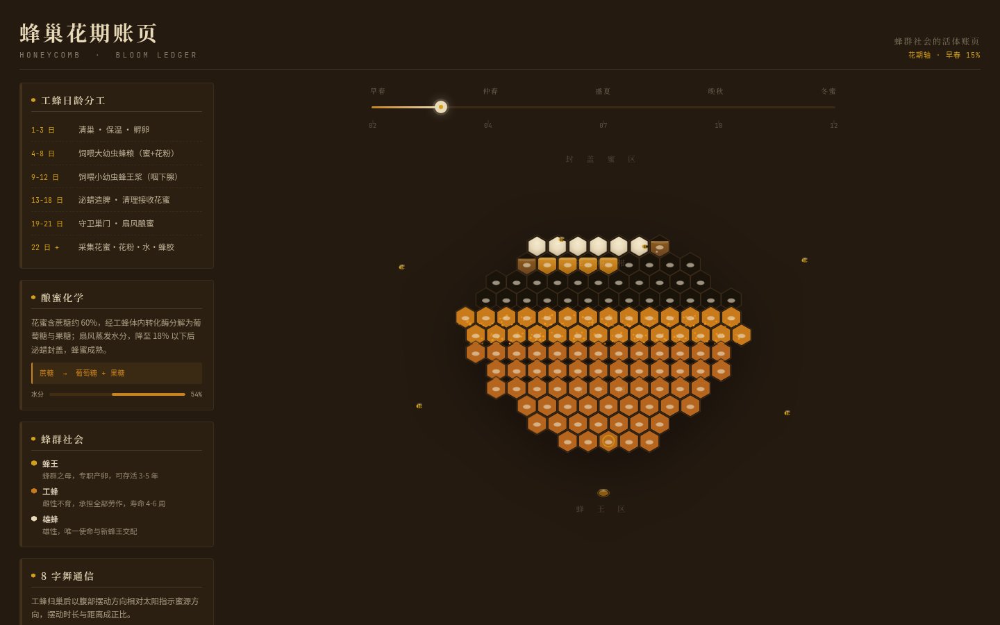

# 蜂巢花期账页 · Honeycomb Bloom Ledger

> 一面悬挂的蜂巢脾——蜂群社会的活体账页。巢房按生物学分区，拖动花期轴让巢房逐格经历「空房 → 注入花蜜 → 水分蒸发 → 封盖成熟」。

## 主题

蜂巢 / 酿蜜 / 蜂群社会。设计观点：蜂巢不是装蜜的罐子，而是一面由蜂群按日龄分工、随花期共同书写并逐格封盖的活体账页。

## 简介

整页是一面固定的六边形蜂巢脾——蜂群社会的活体账页。巢房按真实蜂巢生物学垂直分区：上方封盖蜜区、中部花粉带、下中育子圈、最底蜂王区。巢房之间共享蜂蜡壁，是一整面连续蜡质结构，不是离散卡片。

顶部一条水平「花期轴」（早春油菜 → 深秋枇杷冬蜜）可拖动。拖动它驱动整面巢脾的封盖推进：巢房批量经历四态——空房 → 注入花蜜 → 水分蒸发 → 封盖成熟，封盖波纹沿蜜区从一端传到另一端，水分占比由 60% 连续降至 18%（象征酿蜜化学进度）。被「封盖」的巢房锚定一种真实蜜源植物，悬停时旁侧绽放植物名牌（植物名 / 花期 / 蜜色 / 结晶特性）。左侧信息栏呈现工蜂日龄分工、酿蜜化学、蜂群社会与 8 字舞通信。

**记忆点「封盖瞬间」**：六边形蜡盖从六条边向心闭合，蜜色由透亮金转为成熟浊金。

## 妙搭预览

https://dcniaqwtmoca.feishu.cn/page/E3Uum2a1idLYxFawChfch0UynSs

## 截图

## 核心交互

- **拖动花期轴**：巢房批量经历四态并封盖，水分 60%→18%，季节标签与统计数联动。
- **悬停巢房**：蜡壁共鸣向邻房扩散；已封盖巢房绽放蜜源植物名牌。
- **自定义光标**：微缩工蜂/蜂蜡滴，开页居中，z-index 9999，带蜂飞滞后感。

## 文件说明

| 文件 | 说明 |
|------|------|
| `index.html` | 纯 vanilla 单文件源码（HTML/CSS/JS，65KB） |
| `preview.png` | 1440×900 首屏截图 |
| `设计规范.md` | 配色 / 字体 / 动效系统 / 内容规范 |
| `README.md` | 本文件 |

## 技术栈

- 纯 vanilla 单文件，无 React / Babel / CDN / 外部图片。
- 字体：Noto Serif SC（标题）/ Noto Sans SC（正文）/ JetBrains Mono（数据）。
- 健壮性：零 Console Error、RAF 随可见性暂停、支持 prefers-reduced-motion、1440/1024/768/390 响应式。

## 真实内容

- 10 种蜜源植物与蜂蜜（油菜/椴树/洋槐/荔枝/枣花/柑橘/枇杷/野桂花/荆条/鸭脚木），各含花期·蜜色·结晶特性。
- 蜂群日龄分工 6 阶段、酿蜜化学（蔗糖→葡萄糖+果糖，水分 60%→18%）、蜂群社会三角色、8 字舞通信。

## 设计流水线

本作品按 Orchestrator 设计生产流水线产出：Art Director（5 候选→选六边形巢脾场）→ Design Contract → Designer（app_builder 实现）→ Browser QA（chromium 四尺寸实测 PASS）→ Critic（Contract Fidelity FULL）→ Quality Gate（PASS）→ Memory Writer。详见 `设计规范.md`。
