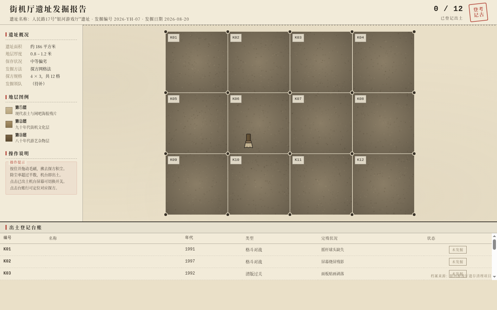

# 街机厅像素考古 · 发掘报告

## 主题
街机厅像素考古 —— 把一处废弃街机厅当作考古遗址来发掘的实验性档案站。

## 简介
整站是一份「人民路17号“银河游戏厅”遗址」的考古发掘现场档案。俯视探方网格（K01–K12）是全站唯一主空间，用户持毛刷光标逐格刷去积尘，出土 12 台真实街机；每台出土即点亮 CRT 屏幕（雪花噪点收敛为磷光绿开机画面），并生成一条出土登记汇入实时台账。

核心交互记忆点：刷扫除尘 + CRT 开机——积尘刷净的瞬间，屏幕从雪花噪点收敛成一条亮线再展开为磷光绿画面，绿光映亮周围探方。

## 截图

（首屏：题头 + 左侧信息栏 + 4×3 探方网格 + 底部出土登记台账，初始积尘状态，毛刷光标居中）

## 妙搭预览
https://dcniaqwtmoca.feishu.cn/page/RZZNm5112dBFuCa5Admc8FHXnxd

## 文件说明
- `index.html` —— 纯 vanilla 单文件实现（含 HTML/CSS/JS，无外部依赖）
- `设计规范.md` —— 真实色值、字体、动效系统、交互说明
- `preview.png` —— 桌面端首屏截图

## 技术栈
- 纯 HTML/CSS/JavaScript（vanilla），单文件，无 CDN / 框架 / 外部字体
- 自定义毛刷光标；canvas `destination-out` 真实除尘；CSS/SVG 绘制机台与像素画面
- 健壮性：RAF/定时器随页面可见性暂停、卸载取消；高频 pointermove 直接操作 DOM；支持 `prefers-reduced-motion`
- 响应式：1440 / 1024 / 768 / 390 四档断点

## 设计语言
牛皮纸档案调（#EAE0C8 / #F2EBD9）+ 测绘墨黑 + 出土登记红 + CRT 磷光绿（仅屏幕语义）。禁蓝紫渐变，磷光绿面积严格受控，整体浅色档案感。标题用仿宋/宋体，编号用等宽字体，呼应考古报告形制。
