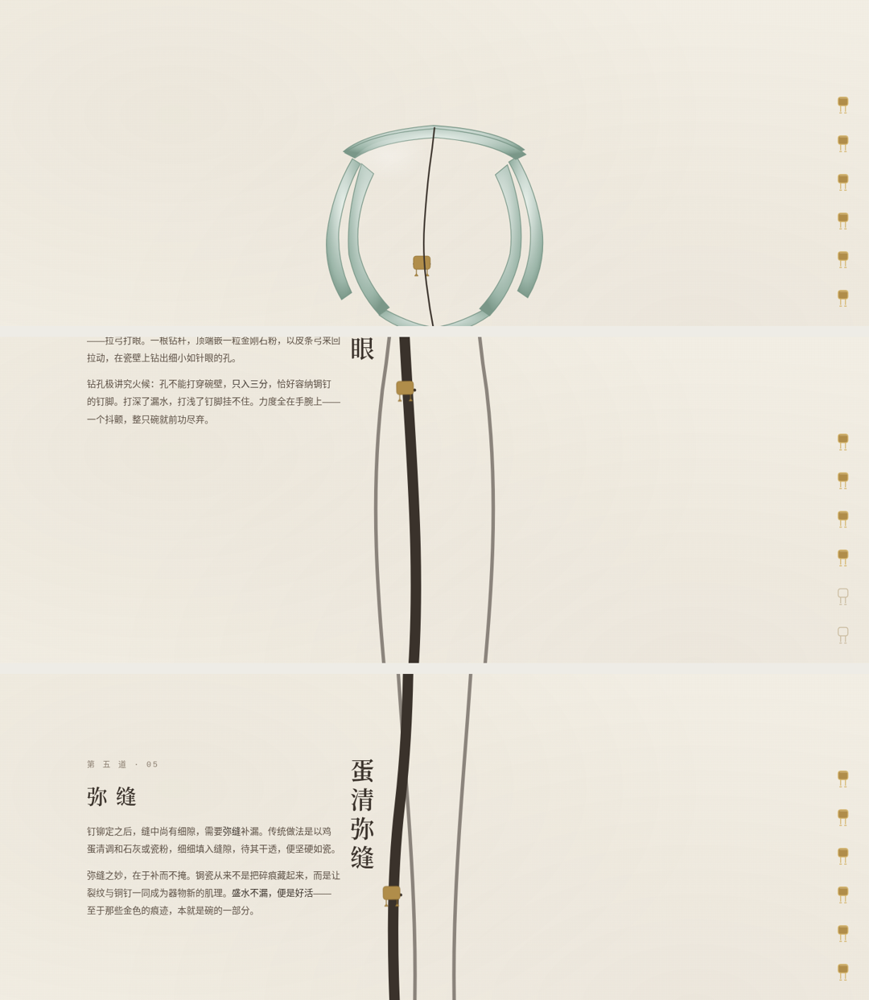

# 锔瓷 · 裂纹长河

> 一只碗的跌落，与它被重新拾起的方式。

## 简介
中国锔瓷手艺主题网页。整页空间本身就是一只碎成七瓣的南宋龙泉窑葵口青瓷碗的侧影纵剖——一条主裂纹从页面顶部贯穿到底部，是全页唯一导航主轴。向下滚动即沿裂纹下行修复，七枚铜锔钉节点随滚动逐颗「钻孔→跨缝→铆合」，滚到碗底即「完璧」。

这不是锔瓷知识介绍页，而是把「裂纹即导航」做成不可替换的空间结构：换成任何别的主题，裂纹主轴立即失去意义。

## 妙搭预览
https://dcniaqwtmoca.feishu.cn/page/OIZrm09u9dpTrraRBqjcT23enjh

## 七章内容（沿裂纹自上而下）
1. **碎** — 开场：完整青瓷碗震裂，主裂纹自绘，「一只碗的跌落」
2. **对缝** — 工序一：找碴对缝，三分锔七分对
3. **捧瓷** — 工序二：绳十字绑扎固定
4. **金刚钻** — 工序三：拉弓打眼只入三分，俗谚「没有金刚钻，别揽瓷器活」
5. **上钉** — 工序四：铜锔钉跨缝铆合，一字钉/米字钉/花钉形制
6. **弥缝** — 工序五：蛋清调石灰补漏，盛水不漏
7. **完璧** — 东京国立博物馆藏南宋龙泉窑「蚂蟥绊」，惜物美学收束，朱红「惜」字印章

## 核心交互
- 滚动沿裂纹下行，经过锔钉节点触发完整铆合流程（瓷屑飞溅→铜钉跨缝弹跳锁定→裂纹拉拢→金属高光→WebAudio 轻「嗒」）。
- 右侧钉形进度索引七枚随修复进度点亮，可点击跳转。
- 自定义光标=金刚钻钻杆，开页居中、随手势微倾。

## 技术栈
- 纯 vanilla 单文件 `index.html`：零外部依赖（无 React / 无 Babel / 无 CDN / 无外部字体 / 无图片，视觉全部 SVG + CSS 绘制）。
- 单一 `requestAnimationFrame` 循环驱动进度；`visibilitychange` 暂停、卸载取消；高频 `mousemove` 直接操作 DOM。
- 全量 `prefers-reduced-motion` 降级。
- 响应式 1440 / 1024 / 768 / 390 实测无横向溢出、无重叠。

## 文件说明
- `index.html` — 全部源码（HTML + CSS + JS + SVG 内联）
- `preview.png` — 三段拼合预览图（开篇 / 中段修复 / 收尾完璧）
- `设计规范.md` — 色彩体系、字体逻辑、动效系统、工程红线
- `README.md` — 本文件

## 质量结论
- Browser QA：chromium 渲染 4 视口，零 Console Error / PageError / Failed Request；内容逐屏真实显示。
- Critic：Contract Fidelity FULL，无 CRITICAL / MAJOR。
- Quality Gate：PASS（CRITICAL=0）。

---
等待协调者检查后提交 GitHub。
