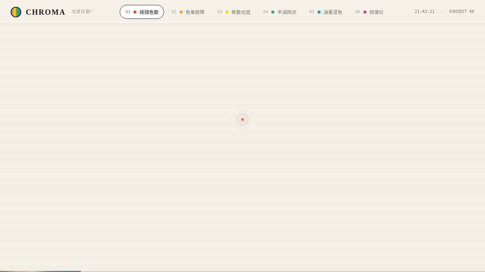

# CHROMA 光谱仪器厂 · UX 交互设计 Mock

- 日期：2026-08-16
- 方向：V3 UX 交互设计
- 主题：把玩「光与色彩」的炫技组件特效实验室 —— 每个展区是独立的组件级特效装置

## 简介

六个可亲手把玩的展区：① 棱镜色散（拖动控制入射角，Snell 定律色散）② RGB 通道错位故障 ③ 焦散光斑扰动 ④ 半调网点印刷显影 ⑤ CMYK 油墨混色 ⑥ 光谱频谱仪（振荡器 / 麦克风驱动）。浅色实验室底 + 石墨黑 + 光谱六色点缀，纯 vanilla 单文件实现。

## 截图

## 动效亮点

- 棱镜色散：6 色折射率实时展开
- 色差故障：鼠标速度驱动 RGB 通道分离
- 焦散光斑：反平方磁力排斥 + Hooke 弹簧 + value noise
- 半调网点：旋转点阵 + 亮度映射 + 光谱色环
- 油墨混色：multiply 减色混合 + CMYK→RGB 实时换算
- 频谱仪：Web Audio FFT + 弹簧柱条 + 示波器
- 自定义光标（弹簧跟随 + 悬停形变 + 点击涟漪）
- 12+ 项组件级特效，`prefers-reduced-motion` 降级

## 妙搭在线预览

https://dcniaqwtmoca.feishu.cn/page/IKfHmN3cOdBC7CaHFSUcCBV9nQc

## 文件说明

| 文件 | 说明 |
|---|---|
| index.html | 完整可运行源码（纯 vanilla HTML + 内联 CSS + 内联 JS） |
| 设计规范.md | 色彩 / 字体 / 展区 / 动效 / 健壮性规范 |
| preview.png | 页面截图 |
| thumbnail.png | 平台生成缩略图 |

## 技术栈

纯 vanilla HTML/CSS/JS 单文件，无 React / 无 Babel / 无外部 CDN 依赖。
