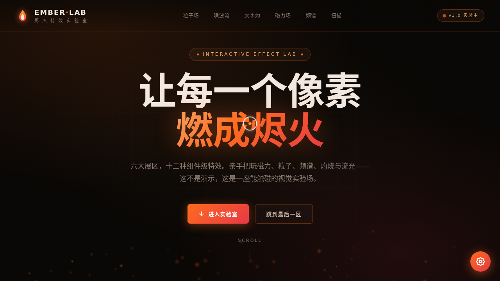

# EMBER 烬火特效实验室

- **日期**：2026-08-16
- **方向**：V3 UX 交互设计（组件）
- **主题**：火光 / 余烬 / 熔岩语义的炫技组件特效装置实验室

## 简介

炭黑 + 烬橙 + 朱红 + 鎏金。六个可亲手把玩的炫技展区：烬火粒子场（流场升腾 + 点击引爆）、熔岩噪波流场（鼠标即热源）、文字灼烧解构（逐字点燃化灰）、磁力形变按钮（反平方引力物理拉扯）、64 频段频谱可视化（柱状/波形/环形）、扫描线 & 光泽流卡片。每个展区都有独立参数预设，上手操作才有意义。

## 动效亮点

14+ 组件级特效：三态自定义光标、全屏烬火粒子背景、火星拖尾、打字机、数字计数、滚动渐入、3D 倾斜、光泽扫过、扫描线、脉冲徽标、弹簧动画、渐变文字、Hero 辉光、滚动提示。

## 文件说明

| 文件 | 说明 |
|---|---|
| `index.html` | 纯 vanilla 单文件（无 React / Babel / CDN），可直接浏览器打开 |
| `设计规范.md` | 色彩 / 字体 / 展区 / 动效 / Tweaks 规范 |
| `preview.png` / `thumbnail.png` | 页面截图 |
| `README.md` | 本文件 |

## 在线预览

妙搭链接：https://dcniaqwtmoca.feishu.cn/page/N4Mzm9rRPdTEU9aMvTUcMJeln3r

## 技术栈

纯 vanilla HTML/CSS/JS 单文件 + Canvas；Tweaks 面板 7 项实时调节（动效强度/粒子密度/背景辉光/光标/火星拖尾/双色 5 色切换）；visibilitychange 暂停 RAF；支持 prefers-reduced-motion。
