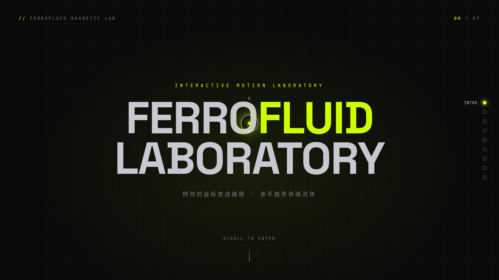

# Ferrofluid 铁磁流体实验室

> Arc 每日设计 Mock · 2026-08-16 batch4 · V3 UX 交互设计



## 在线预览

https://dcniaqwtmoca.feishu.cn/page/ARogmHUs5dbKBmacTFlcy6JGnYd

## 概述

以「铁磁流体」为母题的炫技组件特效实验室，7 个展区每个都必须亲手把玩：拖动磁场看尖刺排列、推动磁簇聚散、解构文字、按磁力按钮……交互运动原理本身即展品。

- **方向**：UX 交互设计（可把玩实验室）
- **主题**：铁磁流体磁力特效
- **配色**：深炭黑 #0a0a0a + 酸性黄绿 #ccff00 + 铜橙 #ff6b1a + 铬银 #c8c8d0（无蓝紫渐变）
- **实现**：纯 vanilla 单文件 HTML+CSS+JS，无 React/Babel/CDN 依赖

## 交互说明

- **01 尖刺**：鼠标即磁极，铁磁流体粒子沿磁力线竖起成尖刺。
- **02 磁场**：拖动磁极改变场线分布。
- **03 磁簇**：推动磁性粒子团，惯性 + 阻尼聚散。
- **04 文字解构**：悬停字符被磁场撕散，松手弹簧回位。
- **05 磁力按钮**：按钮跟随光标偏移，按下涟漪。
- **07 光标拖尾**：多段残影衰减。
- 自定义光标开页居中显示，悬停展区形态变化。

## 动效原理

详见 [设计规范.md](./设计规范.md)。12+ 组件级特效，基于物理模型（反平方引力、弹簧 Hooke、惯性阻尼、角速度积分、法向噪声）。

## 健壮性

- 纯 vanilla 单文件，无 React/Babel/CDN（一次成功无白屏）。
- RAF 随 visibilitychange 暂停；卸载取消。
- 高频 mousemove 直接 DOM transform，不重渲染。
- 支持 prefers-reduced-motion。

## 文件结构

```
2026-08-16_Ferrofluid_铁磁流体实验室/
├── index.html       # 单文件源码
├── preview.png      # 截图
├── 设计规范.md
└── README.md
```

## 本地运行

直接用浏览器打开 `index.html`；或 `python3 -m http.server` 后访问。
