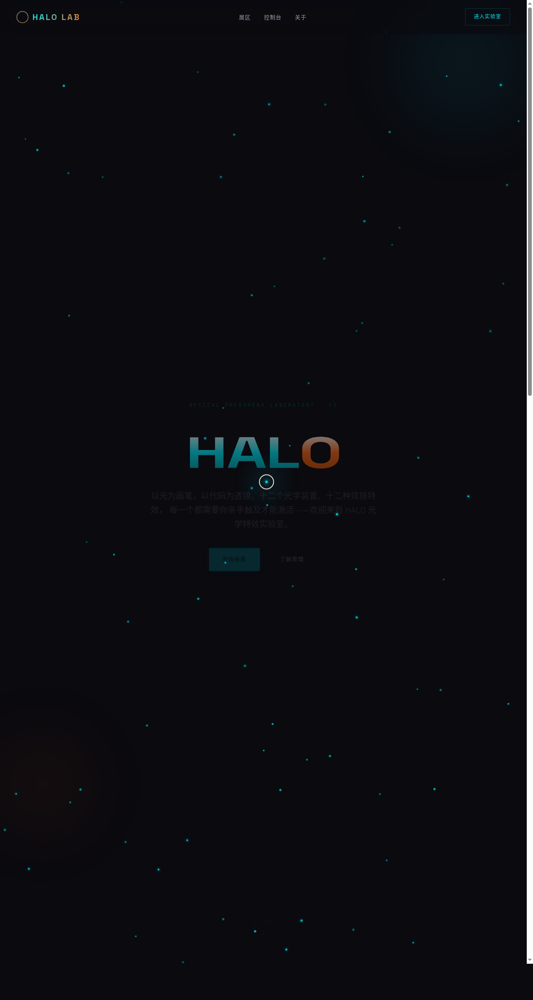

# HALO · 光学特效实验室 Halo Optics Lab

- 日期：2026-08-16
- 方向：UX 交互设计（V3）
- 主题：以光与光学现象为包装的炫技组件特效实验室

## 简介

一件可亲手把玩的单页炫技实验室：12 个独立互动展区，每个都是一个视觉冲击力强的组件级特效装置——粒子星座（反平方引力连线）、频谱分析（弹簧谐振）、噪波流场、文字解构（惯性散射 / 波浪双模式）、磁力形变、光环脉冲、CRT 扫描线滤镜、光码打字机、光子计数器、涟漪池、视差光球、棱镜分光。每个展区带模式切换 chip，必须上手操作才有意义。曜石黑 + 电光青 + 熔岩橙高对比夜色，纯视觉炫技，非物理公式演示。

## 截图

## 动效亮点

- 自定义光标（白环 + 青点 + 发光晕 + 三态切换 + 点击涟漪），开页即居中
- 12 个独立物理特效装置（弹簧 / 反平方引力 / 阻尼 / 噪波场 / Perlin）
- Hero 粒子星云 + 环境光球漂浮
- 全局控制台：光强增幅 / 熔岩模式 / 粒子密度 / 自定义光标开关
- 3D 卡片倾斜 + 滚动渐入 + 光泽扫过

## 妙搭在线预览

https://dcniaqwtmoca.feishu.cn/page/IJ2Vm3UXWdiAQVaoHHtcjyKwnSb

## 文件说明

| 文件 | 说明 |
|------|------|
| index.html | 完整可运行源码（纯 vanilla 单文件） |
| 设计规范.md | 色彩 / 字体 / 展区 / 动效系统 |
| preview.png | 页面截图 |
| thumbnail.png | 平台生成缩略图 |

## 技术栈

纯 vanilla HTML/CSS/JS 单文件，无 React / 无 Babel / 无外部 CDN 依赖（零白屏风险）。
