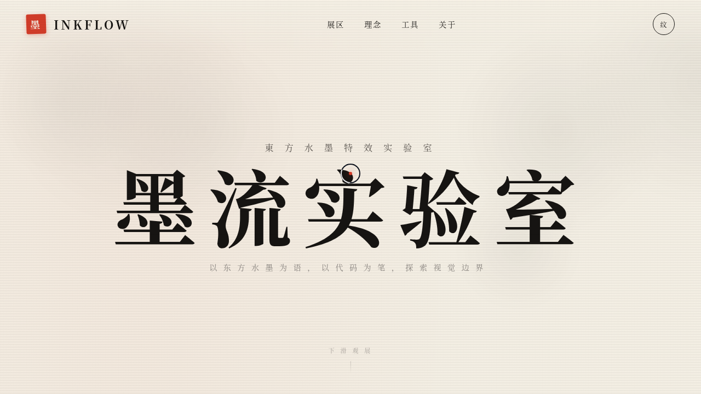

# INKFLOW 墨流实验室

> 2026-08-16 · V3 UX 交互设计 · 组件 mock

## 主题

「INKFLOW 墨流实验室」——以东方水墨为语义母题的炫技组件特效实验室。宣纸白底 + 浓墨黑 + 朱砂红 + 金箔黄，9 个独立展区装置可亲手把玩。**纯 vanilla 单文件实现**（无 React / 无 Babel / 无外部 CDN），从根本上规避白屏风险。

## 简介

每个展区是一个独立、视觉冲击力强的组件级特效装置：墨滴入水扩散、朱砂磁吸印章、金箔频谱闪烁、噪波流场、文字解构粒子、3D 倾斜卡片、金粉光泽扫过、数字计数器、视差深度图层。顶部「纹」按钮可切换扫描线滤镜全局风格。所有展区必须上手操作才有意义。

## 截图

## 动效亮点

- 自定义毛笔光标：三环 + 朱砂光点 + 多层发光，lerp 跟随，移动端回退系统光标
- 墨滴入水扩散：有机不规则形状 + 阻尼增长
- 朱砂磁吸印章：反平方引力 + 弹簧物理 + 脉冲环
- 金箔频谱：28 根波柱多频正弦叠加 + 随机闪光
- 噪波流场：伪 Perlin 噪声 + 鼠标排斥力
- 文字解构：像素采样 + 爆炸/复位弹簧
- 共 19 项组件级特效

## 妙搭在线预览

https://dcniaqwtmoca.feishu.cn/page/MrPLmHn5Ad9A14apa8XcE3CGnOd

## 文件说明

| 文件 | 说明 |
|---|---|
| index.html | 完整可运行源码（纯 vanilla HTML/CSS/JS 单文件） |
| 设计规范.md | 色彩系统、字体、展区装置、动效系统、健壮性 |
| thumbnail.png | 页面截图 |

## 技术栈

原生 HTML/CSS/JavaScript 单文件，Canvas 2D + DOM transform，零外部依赖。
