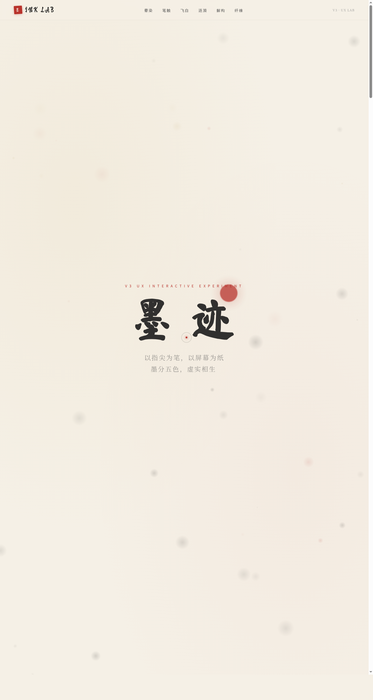

# INK 墨迹实验室

- **日期**：2026-08-16
- **方向**：V3 UX 交互设计
- **主题**：INK 墨迹实验室——以中国传统水墨为灵感的炫技组件特效实验室
- **配色**：宣纸米白 `#F5F0E6` + 松烟墨黑 `#1A1A1A` + 朱砂红 `#B8322B` + 金箔 `#C9A961`（水墨系，无蓝紫渐变）

## 简介

六个独立可把玩的墨迹特效展区，每个展区必须上手拖动/点击/移动才有意义：墨迹晕染扩散、毛笔笔触拖尾（带压感）、飞白粒子迸溅、滴墨涟漪干涉、水墨文字解构重组、宣纸纤维 Perlin 流场。纯 vanilla 单文件实现，零外部依赖。

## 截图

## 动效亮点

- 墨迹晕染（表面张力扩散 + 纤维渗透）
- 笔触拖尾（速度-宽度映射 + 散毫飞白）
- 飞白迸溅（动量衰减粒子群）
- 滴墨涟漪（同心扩散 + 波叠加干涉）
- 文字解构（粒子缓动回归字形）
- 纤维流场（Perlin 噪声向量场）
- 自定义光标（白环 + 朱砂内点 + 三态 + 涟漪 + 拖尾）
- 共 12+ 项组件级特效

## 妙搭在线预览

https://dcniaqwtmoca.feishu.cn/page/VXG5myEPjdbAtZaoMCscjVxOnpd

## 文件说明

| 文件 | 说明 |
|---|---|
| `index.html` | 完整可运行源码（纯 vanilla 单文件，零外部依赖） |
| `preview.png` | 页面预览截图 |
| `设计规范.md` | 色彩系统、字体、展区、组件、动效规范 |

## 技术栈

纯 HTML / CSS / JavaScript（vanilla，无 React / Babel / CDN 依赖）
