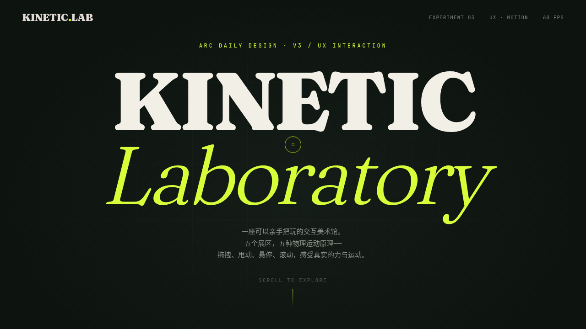

# KINETIC — 动力学交互实验室

> 2026-08-16 · UX 交互设计

## 简介

把 UX 运动原理本身当展品——整页是一座可以亲手把玩的交互美术馆，5 个展区每个都得上手玩。配色为深墨绿炭黑 + 酸性荧光黄绿 + 米白，所有运动均为 RAF 弹簧积分器驱动的物理模型（F = -kx + 阻尼 / 摩擦 / 弹性边界），非 CSS 过渡。

## 截图

## 文件说明

| 文件 | 说明 |
|------|------|
| `index.html` | 浏览页（双击即可打开预览，单文件完整源码） |
| `package.json` | 依赖声明 |
| `设计规范.md` | 设计规范文档（色彩 / 字体 / 展区 / 健壮性红线） |

## 五大展区

1. **弹性弹簧振荡** — 拖拽荧光球松手，Hooke 定律下的真实振荡衰减
2. **惯性拖拽滑动** — 抓住轨道甩出去，动量 + 摩擦衰减的自然滑行
3. **磁性吸附按钮** — 悬停时核心被反平方引力场拖拽
4. **滚动驱动形变** — 往下滚，方形 → 圆形 → 流体，滚动进度即形变时间轴
5. **视差纵深空间** — 移动鼠标，四层以不同速率独立位移

## 自定义光标

8 段拖尾 + 抓取 / 悬停 / 拖拽三态形态切换，初始即显示在屏幕中央。

## 健壮性

零未定义引用 · RAF / 定定器随页面可见性自动暂停 · 快速操作不叠加定时器 · 支持 `prefers-reduced-motion`。

## 在线预览

妙搭应用链接：https://dcniaqwtmoca.feishu.cn/page/KcX5muy3VdL8fIampUUcJXcInhf

## 技术栈

纯 HTML + CSS + JavaScript（单文件），无框架依赖。
