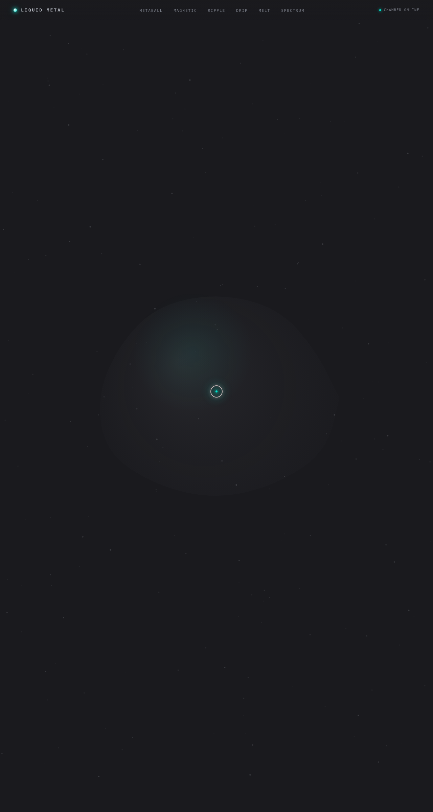

# LIQUID METAL 液态金属特效舱 — UX 交互实验室

> 2026-08-16 · UX 交互设计

## 简介

以「液态金属 / 汞银 / 镜面流动」的物理特性为展品的可亲手把玩实验室。6 个舱室每个围绕一种液态金属物理原理：水银合并、磁引力液、液态涟漪、熔融滴落、金属熔字、铬合金频谱。深石墨黑 + 镜面银 + 电弧青配色，合成器冷峻金属质感。每个展区必须上手操作才有意义。

## 截图

## 文件说明

| 文件 | 说明 |
|------|------|
| `index.html` | 单文件实现（HTML + CSS + JS 全内联） |

## 六个舱室

| 舱室 | 物理原理 | 交互方式 |
|------|----------|----------|
| 01 Metaball 水银合并场 | 表面张力 + 磁场引力 | 鼠标移动施引力 / 滑块调参 / 脉冲爆发 |
| 02 Magnetic Drops 磁引力液 | 反平方引力 + 惯性动量 | 移动汇聚 / 点击斥力脉冲 |
| 03 Ripple Pool 液态涟漪 | 阻尼正弦波 + 干涉叠加 | 点击液面产生波纹 |
| 04 Molten Drip 熔融滴落 | 重力 + 黏滞阻尼 + 溅射 | 4 档流速切换 |
| 05 Metal Melt 金属熔字 | 熔解动画 + 液滴下落 | 悬停扭曲 / 点击液化滴落 |
| 06 Chrome Spectrum 铬合金频谱 | Hooke 弹簧振子 + 阻尼振荡 | 4 种模式切换 |

## 动效亮点

- 自定义光标：弹簧跟随 + 悬停形变 + 点击涟漪
- 镜面银拖尾粒子 + 环境漂浮微粒
- Hero 液态金属形变 + 滚动渐入 + 数字计数
- 3D 倾斜卡片 + 光泽扫过
- Metaball 合并分离 + 磁引力粒子 + 涟漪干涉
- 熔融滴落溅射 + 金属熔字 + 镀铬频谱柱 + 脉冲发光

## 健壮性

`visibilitychange` 自动暂停所有 RAF 循环、离屏舱室停止渲染、prefers-reduced-motion 全量降级、窗口 resize 防抖重建画布、定时器统一管理无泄漏。

## 在线预览

妙搭应用链接：https://dcniaqwtmoca.feishu.cn/page/IrPjmkqvvd3GOvaVKuDcLPYjn8c

## 技术栈

纯原生 vanilla 单文件 HTML/CSS/JS，无 React / Babel / 任何 CDN 依赖。
