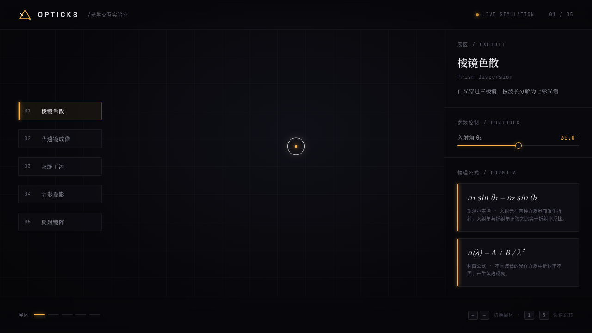

# OPTICKS · 光学交互实验室

> 2026-08-16 · UX 交互设计（V3） · 可亲手把玩的物理原理展区

以光学物理原理本身为展品的交互实验室，5 个展区都基于真实物理公式实时计算：棱镜色散、凸透镜成像、双缝干涉、阴影投影、反射镜阵。拖拽 / 滑动 / 调参即可实时观察物理规律。

## 设计说明

- **配色**：漆黑舞台底 `#050508` + 白光 `#F8F8FF` + 光学琥珀 `#FFB347`，棱镜光谱色仅作为色散 / 干涉的物理语义出现
- **字体**：Space Grotesk（展示）/ Noto Serif SC（公式）/ JetBrains Mono（读数）
- **动效亮点**：光子粒子沿光线路径运动、光谱渐变描边、波前环形扩散、展区切换入场（位移 + 模糊 + 缩放）、自定义光标（白环 + 琥珀内点 + 涟漪）、滑块拖拽发光
- 详见 [设计规范.md](./设计规范.md)

## 在线预览

飞书妙搭应用：https://dcniaqwtmoca.feishu.cn/page/XwN0mjaCOdxus6a3pqTcRLxhnff

## 文件说明

| 文件 | 说明 |
|------|------|
| `index.html` | 入口 |
| `styles.css` | 全局样式与设计令牌 |
| `src/app.jsx` | 主应用与展区路由 |
| `src/cursor.jsx` | 自定义光标 |
| `src/exhibits/` | 5 个展区实现 |
| `设计规范.md` | 色彩 / 字体 / 展区 / 动效规范 |
| `thumbnail.png` | 实验室截图 |

## 技术栈

纯 HTML + CSS + 原生 JS（Canvas 2D），无构建步骤、无外部框架。
