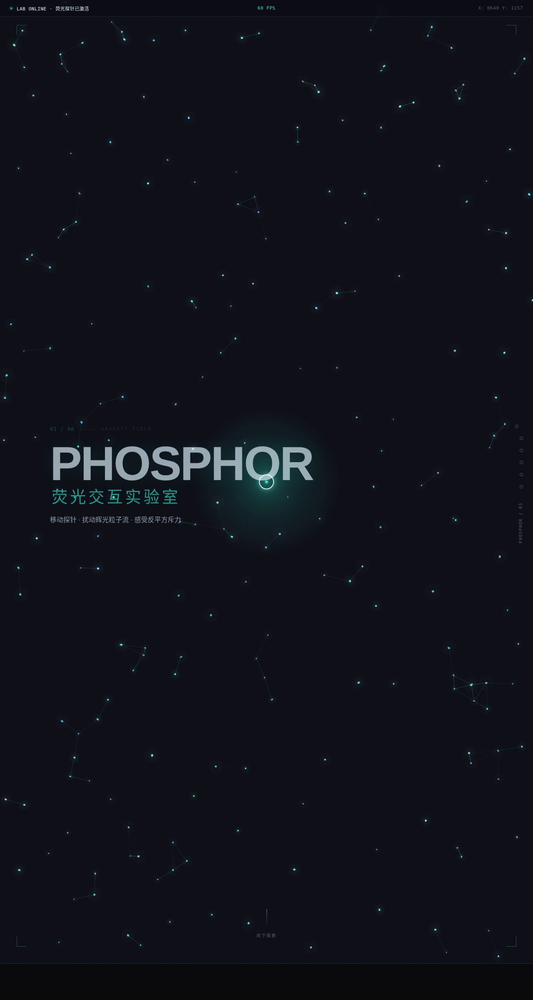

# PHOSPHOR 荧光交互实验室

> Arc 每日设计 Mock · 2026-08-16 · V3 UX 交互设计

## 基本信息

- **日期**：2026-08-16
- **版本**：V3
- **方向**：UX 交互设计（可亲手把玩的运动原理实验室）
- **主题**：PHOSPHOR 荧光交互实验室 —— 以荧光 / 辉光物质为意象的炫技特效实验室
- **配色**：石墨黑 `#101014`（底）+ 荧光青 `#2DE1C2` + 冰蓝白 `#DFF6FF` + 暗灰阶，无蓝紫渐变
- **实现**：纯 vanilla HTML/CSS/JS 单文件，无 React/Babel/CDN 依赖

## 设计说明

6 大可亲手把玩展区，每个展区必须上手操作才产生意义：辉光粒子引力场（Hero）→ 电磁拉丝 → 荧光字形解构 → 磁力按钮 → 磷光频谱 → 信号尾迹 CODA。整体追求暗室荧光的物理仪表感，所有动效基于物理模型。

## 交互说明

- 辉光粒子引力场：鼠标移动扰动 220 粒子流场，产生反平方斥力与连线
- 电磁拉丝：拖拽 5 个锚点，弹性光子弦按 Hooke 定律回弹
- 荧光字形解构：鼠标靠近「PHOSPHOR」标题溃散，远离弹簧收敛
- 磁力按钮：6 枚按钮以反平方引力被鼠标吸附，阻尼归位
- 磷光频谱：鼠标上下激发 64 根频谱柱对应频段，独立简谐阻尼振荡
- 信号尾迹：彗星粒子流背景 + 打字机循环 + 重置按钮光泽扫过

## 动效原理（14 个组件级特效）

自定义光标（三环不同惯性）/ 光标拖尾彗星粒子 / 辉光粒子引力场 / 电磁弹性拉丝（Hooke）/ 字形解构聚散（弹簧）/ 磁力吸附按钮（反平方引力 + 阻尼）/ 磷光阻尼频谱（简谐振荡）/ 彗星背景流 / 点击涟漪 / 打字机 / 数字计数 / 光泽扫过 / 滚动渐入 / 视差滚动。统一 `PH.RAF` 管理器，`visibilitychange` 自动暂停/恢复，各展区 IntersectionObserver 启停，`prefers-reduced-motion` 完整降级。

## 截图



## 在线预览

https://dcniaqwtmoca.feishu.cn/page/XryomGVsGdvaGCahp45cjAgunbb

## 文件结构

```
2026-08-16_PHOSPHOR_荧光实验室/
├── index.html      # 入口（含交互逻辑）
├── styles.css      # 样式
├── js/             # 脚本
├── preview.png     # 截图
└── README.md
```

## 本地运行

```bash
cd 2026-08-16_PHOSPHOR_荧光实验室
python3 -m http.server 8090
# 浏览器打开 http://127.0.0.1:8090
```
