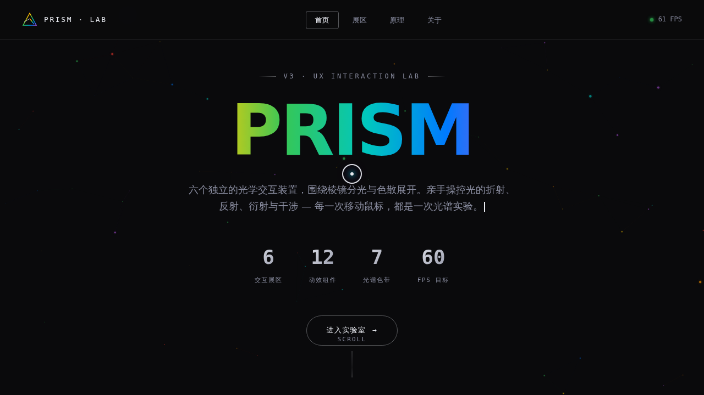

# PRISM 棱镜光谱实验室

- 日期：2026-08-16
- 方向：V3 UX 交互设计
- 主题：以棱镜分光 / 色散 / 光谱为核心意象的炫技组件特效实验室
- 配色：纯黑 #0A0A0C + 光谱七色（红橙黄绿青蓝品红）+ 银白 #E8EAF0

## 简介

「PRISM」是一座可亲手把玩的光学特效实验室，六个展区各是一件独立的视觉冲击装置：棱镜分光（调入射角看彩虹色散）、万花筒镜像（绘制轨迹 N 重对称复制）、光绘拖尾（长按画发光丝带）、磁力网格（光标磁性形变粒子阵）、CRT 扫描线滤镜（实时叠加扫描线/色差/辉光）、光谱文字解构（文字碎裂成色散粒子再重组）。每个展区必须上手操作才有意义。

## 截图

## 动效亮点

自定义光标（三态 + 涟漪）、光标粒子拖尾、Hero 环境粒子连线、打字机、数字计数、卡片 3D 倾斜、滚动渐入、光谱标题流光、光泽扫过按钮、状态脉冲、扫描条下落、Hero CTA 光扫。物理模型：反平方律磁力、弹簧回弹、Hooke 重组、惯性动量。

## 妙搭在线预览

https://dcniaqwtmoca.feishu.cn/page/FGn6mGe2fdJr13aPwiXcogoPnqy

## 文件说明

| 文件 | 说明 |
|---|---|
| index.html | 完整可运行源码（纯 vanilla 单文件，无外部依赖） |
| 设计规范.md | 色彩系统、字体、展区、动效、健壮性 |
| preview.png | 实验室截图 |

## 技术栈

纯 vanilla HTML/CSS/JS 单文件实现，无 React / 无 Babel / 无外部 CDN。运行于妙搭 html 应用。
